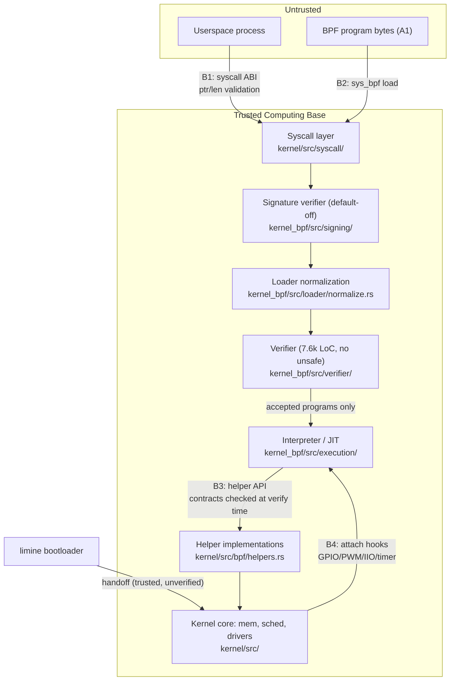

# Axiom Threat Model & Assurance Positioning

**Status:** Living document. Line citations refer to commit `f2e38bc`
(branch `feat_verifier_hardening`, 2026-07-03); they drift as code moves —
trust the named function over the line number.

**Resolves:** #39 (RFC: Threat Model & Formal Assurance Gap vs seL4).

## 1. Summary

Axiom is a research kernel for robotics workloads. Untrusted logic runs as
eBPF-style programs verified before execution; the kernel itself is Rust
`no_std` with audited `unsafe`. This document defines what Axiom defends
against, which code enforces each boundary, how large the trusted computing
base is, and where Axiom honestly sits relative to seL4.

The one-line answer to #39's question — *what safety class does Axiom belong
to?* — is:

> **Engineering safety.** Memory-safe implementation language, a
> load-bearing static verifier with zero `unsafe`, WCET admission control,
> and a growing test corpus — but no machine-checked proofs, no verified
> scheduler, and no capability system. Axiom is "safer than Linux by
> construction" in its BPF path, and materially less proven than seL4
> everywhere. The roadmap (section 8) narrows that gap where it pays.

## 2. Asset inventory

| Asset | Where | Notes |
|---|---|---|
| Kernel image | `kernel/` (boots via limine, `kernel/src/limine.rs`) | Compromise = total |
| BPF verifier | `kernel/crates/kernel_bpf/src/verifier/` (7,649 LoC, zero `unsafe`) | The load-bearing safety gate |
| BPF interpreter | `kernel/crates/kernel_bpf/src/execution/interpreter.rs` | Must match verifier's semantics |
| aarch64/x86_64 JIT | `kernel/crates/kernel_bpf/src/execution/jit_aarch64.rs`, `kernel/src/bpf/jit_memory.rs` | Cloud profile only (`JIT_ALLOWED=false` on embedded); output **not re-verified**; W^X pages via `jit_memory.rs` |
| Attach points | GPIO, PWM, IIO, timer, syscall hooks (`kernel_bpf/src/attach/`) | Physical actuation — highest-consequence outputs |
| BPF maps | `kernel_bpf/src/maps/` | Shared state between programs and kernel |
| Signing trust store | `kernel_bpf/src/signing/` (Ed25519, 1,857 LoC) | Implemented; **enforcement default-off** (§5, #20) |
| Persistent state | rootfs, crash-dump region | No integrity protection today |
| Control link | `shrike_link` UART to RP2040 sidecar | Fail-safe state machine on link loss |

## 3. Adversary classes

| # | Adversary | In scope? | Verdict |
|---|---|---|---|
| A1 | Malicious BPF author (program bytes fully attacker-chosen) | **Yes — primary** | This is the threat the verifier exists for. Defended (§5.1–§5.6). |
| A2 | Compromised userspace (arbitrary syscalls) | **Yes** | Syscall boundary validated (§5.7); but no per-caller privilege on BPF ops today (§6, gap G2). |
| A3 | Remote network attacker (crafted BPF over OTA) | **Partially** | No NIC driver exists yet; OTA path is out-of-band (SD card / serial). Becomes primary when networking lands. |
| A4 | OTA-MITM (replaces kernel/program update) | **Partially** | Ed25519 program authentication implemented but default-off (§5.8). Kernel image itself unsigned. |
| A5 | Physical access (JTAG, SD swap, side channels) | **No** | Out of scope. A robot in an attacker's hands is the attacker's robot. |
| A6 | Supply chain (malicious cargo dependency) | **Acknowledged, not defended** | `no_std` kernel keeps the dependency tree small; no vendoring/audit gate yet. |
| A7 | Speculative-execution attacker (Spectre-class via BPF) | **Known gap** | No mitigations (#89). Verifier reasons about architectural, not speculative, execution. |

## 4. Trust boundaries

- **B1 userspace↔kernel:** every userspace pointer/length validated before
  use (`kernel/src/syscall/validation.rs`).
- **B2 BPF↔kernel (load):** authenticate (when enabled) → normalize →
  verify. Nothing executes unverified.
- **B3 BPF↔kernel (runtime):** programs touch the kernel only through
  helpers whose signatures and argument bounds were checked at verify time.
- **B4 attach:** hook attachment re-verifies with the hook's real ctx size
  and passes EDF admission.
- **Bootloader↔kernel:** limine handoff is trusted and unverified (no
  secure/measured boot).

## 5. Mitigation map (adversary → enforcing code)

Primary defense per attack, cited as `file:line` at commit `f2e38bc`:

### 5.1 A1: out-of-bounds memory access
- Stack bounds: `kernel_bpf/src/verifier/core.rs:989` (load), `:1051`
  (store) via `stack.is_valid_access`.
- Map-value / ctx / packet bounds: `check_ranged_deref`,
  `verifier/core.rs:1403`; per-map value sizes threaded from the manager
  (#123, closed); ctx sized per program type (#122, closed).

### 5.2 A1: unbounded execution
- Verifier state budget: `verifier/core.rs:440` (`StateLimitExceeded`),
  worklist exploration `core.rs:398`; caps in `verifier/pruner.rs:200`
  (8,192 states, 64 per-pc).
- Interpreter backstop: `execution/interpreter.rs:587` — hard instruction
  limit (100k embedded / 1M cloud) independent of the verifier.

### 5.3 A1: stack / call-depth abuse
- Stack size bound: `bytecode/program.rs:205`, surfaced at
  `verifier/core.rs:279`.
- BPF-to-BPF inlining caps (#87): `loader/normalize.rs:20`
  (`MAX_CALL_DEPTH = 8`), expansion size cap `normalize.rs:368`.

### 5.4 A1: helper contract abuse
- Verify-time: `verifier/core.rs:844` (`validate_helper_call`), privilege
  tier `core.rs:846`, pointer-arg bounds `core.rs:857`; signature registry
  `verifier/helpers.rs:398` (IDs unified with runtime after #121).
- Runtime table: `kernel/src/bpf/helpers.rs`.

### 5.5 A1: arithmetic corruption
- Div/mod-by-zero rejection: `verifier/core.rs:607–617`.
- Uninitialized register reads rejected at every dispatch site
  (`core.rs:508` and per-class checks).
- Overflow tracking: tnum + signed/unsigned ranges in `verifier/state.rs`,
  ALU transfer functions `verifier/alu.rs` (ALU32 width bugs fixed in #114).

### 5.6 A1: real-time starvation via legitimate-looking programs
- Static WCET budget at verify time: `verifier/core.rs:1220`
  (`WcetExceeded`), Pi5-calibrated cost model `verifier/cost.rs`.
- EDF utilization admission at attach: `kernel/src/bpf/mod.rs:425` →
  ledger Σ WCETᵢ·freqᵢ ≤ budget, `verifier/admission.rs:94`.

### 5.7 A2: syscall boundary
- `kernel/src/syscall/validation.rs:19` (`validate_range` on every
  userspace pointer), used by the BPF load path at
  `kernel/src/syscall/bpf.rs:448–478`.
- Attach-time device validation: GPIO pin range `syscall/bpf.rs:336`, PWM
  chip/channel `:385`.

### 5.8 A4: program authenticity
- Ed25519 signature verification: `signing/verifier.rs:139` (trusted-signer
  + hash + signature; real curve math, not a stub); enforced on the ELF
  path at `kernel/src/bpf/mod.rs:276` and raw loads rejected at `:331` —
  **but only when `allow_unsigned` is false, and the default is `true`**
  (`mod.rs:179`). No key-provisioning story yet. Until an operator flips
  enforcement on, assume A1 can load programs freely (which is exactly the
  assumption the verifier is built under).

### 5.9 A1/A2: execution engine integrity
- Embedded profile (the robot deployment) runs the interpreter only
  (`JIT_ALLOWED = false`, `kernel_bpf/src/profile/mod.rs:268`).
- Cloud profile may JIT (`kernel/src/bpf/mod.rs:470` gate); JIT pages are
  W^X (`kernel/src/bpf/jit_memory.rs`). JIT output is **not re-verified**
  — verifier soundness must carry the JIT too (gap G3).

## 6. Gaps (each files or references an issue)

| ID | Gap | Issue |
|---|---|---|
| G1 | Spectre-class speculative execution unmitigated | #89 |
| G2 | No privilege check at the attach syscall boundary — `AttachError::PermissionDenied` exists (`attach/mod.rs:139`) but is never returned; the only tiering is helper `min_tier` at verify time. Any userspace that can issue `sys_bpf` can attach to any hook. | file new issue |
| G3 | JIT output not independently checked; JIT is inside the TCB on cloud profile | file new issue |
| G4 | Signature enforcement default-off; no key provisioning | #20 |
| G5 | No secure/measured boot; limine handoff trusted | file new issue |
| G6 | Dependency supply chain unaudited (no `cargo vet`/vendoring) | file new issue |
| G7 | Kernel image and persistent state unsigned/unprotected at rest | subsumed by #20 scope or new issue |

## 7. TCB sizing and the seL4 comparison

Measured with `wc -l` over `*.rs` (excluding `tests/` directories), commit
`f2e38bc`:

| Component | LoC | In TCB? |
|---|---|---|
| Kernel core (`kernel/src`) | 20,756 | Yes |
| BPF subsystem (`kernel_bpf`, incl. verifier) | 26,258 | Yes |
| — of which verifier | 7,649 | Yes (zero `unsafe`) |
| All kernel crates | 36,564 | Yes |
| **Axiom TCB (order of magnitude)** | **~57k LoC Rust** | — |
| `unsafe` occurrences across kernel (grep, incl. some comments) | ~700 | audit surface |

seL4 for contrast: ~8,700 LoC of C (+~600 asm) with machine-checked
functional correctness in Isabelle/HOL, plus proved integrity and
information-flow properties, binary-level verification on ARM, and published
WCET analysis.

The honest read: Axiom's TCB is ~6× seL4's, and seL4's is *proven* while
ours is *trusted*. "TCB" means different things in the two systems —
seL4's is bounded by proof, Axiom's by Rust's type system, the verifier
(itself unproven, hence #91), tests, and review.

| Dimension | Axiom (today) | seL4 |
|---|---|---|
| Implementation language | Rust `no_std` | C + asm |
| Memory safety basis | Type system + audited `unsafe` (~700 sites) | Machine-checked proof |
| Untrusted-code model | Verified BPF programs on kernel hooks | Capability-confined user tasks |
| Isolation model | Verifier-enforced sandbox; no capabilities | Capability-based, proven integrity/confidentiality |
| Scheduler | EDF + WCET admission (tested, unproven) | Priority; MCS variant with proofs; starvation-freedom analyzable |
| Formal proofs | None (Lean PoC in `formal/`, #91) | Functional correctness → binary level |
| TCB size | ~57k LoC Rust | ~9.3k LoC C/asm |
| WCET story | Pi5-calibrated cost model + EDF admission | Published WCET analysis of kernel paths |
| External review | Pending (#77) | 15+ years of it |

Axiom's differentiator is not assurance depth — it is that **untrusted,
hot-swappable robotics logic is a first-class kernel object** with static
safety and timing admission. seL4 gives you a proven microkernel and leaves
policy to userland; Axiom gives you an unproven but verifier-guarded
programmable data path. These are different points in the design space, and
the roadmap borrows seL4's discipline where it fits.

## 8. Answers to #39's open questions

- **Is the streaming verifier formally specified?** Moot — retired
  2026-06-13. The path-sensitive `Verifier` is the sole artifact.
- **Can the verifier be formally specified?** Yes, incrementally. The tnum
  operators are pure functions with Linux-equivalent semantics already
  SMT-verified upstream by Agni (CAV'23). A Lean 4 PoC formalizing the tnum
  domain with soundness proofs for representative operators lives in
  `formal/`; the roadmap to a full "verifier accepts ⇒ interpreter safe"
  theorem is in `formal/README.md` (#91).
- **Is the scheduler starvation-free?** Unproven. EDF with utilization-bound
  admission gives the standard analytical argument when Σ WCET·freq ≤ budget
  holds and WCETs are honest; no mechanized proof, and non-RT work relies on
  the RT budget cap.
- **Can the helper API be capability-restricted?** The mechanism exists in
  embryo (helper `min_tier` + `LoadCaller`); a real capability model needs
  per-process credentials (#67) and closing gap G2.
- **Target assurance tier:** engineering safety now; high-assurance robotics
  (external review #77 + formal core #91 + signing-on-by-default #20) is the
  v1.0 trajectory. Defense-grade is not claimed and not pursued.

## 9. Related documents

- [SECURITY.md](../SECURITY.md) — reporting and disclosure policy
- [docs/security/verifier-review-call.md](security/verifier-review-call.md) — external review challenge (#77)
- [docs/verifier-fragment.md](verifier-fragment.md) — verified fragment + WCET bound
- [formal/README.md](../formal/README.md) — formalization PoC + roadmap (#91)
