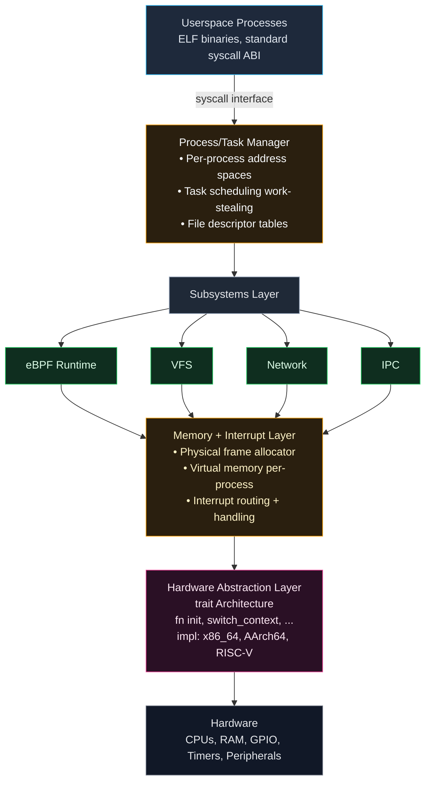
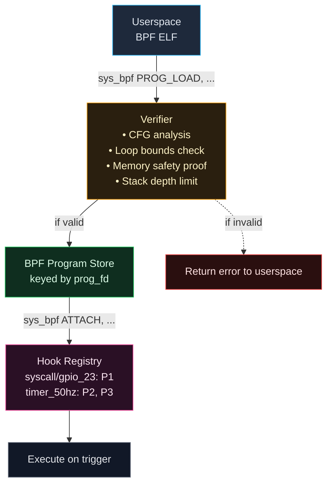

# Axiom Architecture

Deep-dive companion to the [README](../README.md). The README states what Axiom
is and what works; this document explains how it is built.

---

## System Layers



**Monolithic justification:** Microkernel IPC overhead (100-1000ns per message)
is unacceptable for control loops. Monolithic structure with Rust trait
boundaries provides modularity without performance cost.

---

## Rust Core (`no_std`)

The kernel is ~95% Rust, `no_std`, with `panic=abort`:
- Memory safety enforced by ownership/borrowing
- Explicit `unsafe` boundaries (documented and audited)
- Zero-cost abstractions
- Assembly limited to boot stubs and exception vectors

**What this prevents:**
```rust
// Prevented at compile time:
let ptr = allocate_buffer();
free(ptr);
use(ptr);  // ❌ use-after-free caught by borrow checker

// Prevented by explicit unsafe:
fn modify_page_table(ptr: *mut PageTable) {
    unsafe {  // Forced to acknowledge danger
        (*ptr).entries[0] = new_entry;
    }
}
```

**Why not C:** C relies on programmer discipline. Rust encodes invariants in the
type system. In kernel context, this eliminates entire bug classes
(use-after-free, double-free, iterator invalidation, data races).

---

## Execution Model

### Process vs Task Separation

```rust
struct Process {
    pid: ProcessId,
    name: String,
    address_space: RwLock<Option<AddressSpace>>,
    file_descriptors: RwLock<BTreeMap<FdNum, FileDescriptor>>,
    // Tasks reference the process via Arc<Process>
}

struct Task {
    tid: TaskId,
    process: Arc<Process>,
    last_stack_ptr: Pin<Box<usize>>,
    kstack: Option<HigherHalfStack>,
    ustack: RwLock<Option<LowerHalfAllocation<Writable>>>,
}
```

**Why separate:** Traditional UNIX model conflates resource container (process)
with execution context (thread). Separation simplifies:
- Multithreading (multiple tasks referencing one process)
- Resource accounting (process-level, not per-thread)
- Memory isolation (tasks within a process share an address space)

### Scheduler

**Global run queue:**
The current implementation uses a single global MPSC (Multiple Producer, Single
Consumer) queue for task scheduling across all CPUs.

```
Global Queue: [T1, T4, T7, T2, T5, T3, T6, T8]
CPU 0: Pop → T1
CPU 1: Pop → T4
CPU 2: Pop → T7
```

**Preemption:** Timer interrupts (1ms quantum, configurable via APIC/GIC)
**Cooperation:** `sched_yield()` syscall

**Priority inversion handling:** Priority inheritance protocol (planned).

---

## Syscall Flow

```
1. Userspace executes syscall instruction
2. CPU switches to kernel mode → arch handler
3. Context saved (registers, stack pointer)
4. Syscall number dispatched
   ├─→ BPF pre-hook runs (if attached)
   ├─→ Syscall handler executes
   └─→ BPF post-hook runs (if attached)
5. Return value written to register
6. Context restored → return to userspace
```

**Error convention:** Negative return values are `-errno`:
```rust
// In kernel:
if allocation_failed {
    return -ENOMEM;  // -12
}

// In userspace:
int fd = open("/dev/null", O_RDONLY);
if (fd < 0) {
    // fd == -ENOENT (-2) if file not found
}
```

**Supported syscalls:** `read`, `write`, `open`, `close`, `fork`, `exec`,
`wait`, `sched_yield`, `bpf`, `ioctl`, ...

---

## eBPF Deep Dive

### Program Lifecycle



### Verification Algorithm

**Control Flow Graph Construction:**
```rust
fn verify_program(bytecode: &[u8]) -> Result<(), VerifyError> {
    let cfg = build_cfg(bytecode)?;

    // 1. Ensure all paths terminate (no infinite loops)
    for node in cfg.nodes() {
        if has_backedge(node) && !has_bounded_iteration(node) {
            return Err(VerifyError::UnboundedLoop);
        }
    }

    // 2. Check stack depth on all paths
    let max_depth = cfg.compute_max_stack_depth();
    if max_depth > STACK_LIMIT {
        return Err(VerifyError::StackOverflow);
    }

    // 3. Validate memory access
    for instr in cfg.instructions() {
        if let MemoryAccess { addr, size } = instr {
            if !is_valid_access(addr, size) {
                return Err(VerifyError::InvalidMemory);
            }
        }
    }

    Ok(())
}
```

The full verifier goes well beyond this sketch: tnum bit-tracking, state
pruning, range refinement, and per-instruction liveness are wired into
`verify_alu`, `verify_jump`, and `verify_safety`
([state.rs](../kernel/crates/kernel_bpf/src/verifier/state.rs),
[pruner.rs](../kernel/crates/kernel_bpf/src/verifier/pruner.rs),
[refine.rs](../kernel/crates/kernel_bpf/src/verifier/refine.rs),
[liveness.rs](../kernel/crates/kernel_bpf/src/verifier/liveness.rs)), with
width-correct 32-bit ALU semantics, typed maybe-null map/ctx pointer bounds, a
bounded state budget, an explicit worklist, and sparse stack state. Helper IDs
are unified across verifier, interpreter, and loader relocation; load-time ctx
size is bound to `BpfContext`; map value sizing is per-map precise. See
[kernel_bpf/docs/VERIFICATION.md](../kernel/crates/kernel_bpf/docs/VERIFICATION.md)
for the algorithm in detail.

### WCET Admission

The verifier computes a static worst-case cycle bound per program from a cost
model calibrated on Pi 5 (Cortex-A76) hardware, including per-helper costs. A
program whose WCET cannot fit one control-loop period (~166k cycle units at
1 kHz) is rejected at load, and each attach commits `wcet × freq` to a
utilization ledger capped at U = 0.5 — the EDF utilization test, validated on
silicon. `trace_printk` is banned on RT hooks. Verification cost itself is
measured and near-linear (~80–94 cycles/insn on A76). See
[benchmarks.md §12](benchmarks.md).

### Signing

The `sys_bpf` load path authenticates program provenance: signed containers are
verified (Ed25519) against a kernel-held trust store and fail closed on any bad
signature. Unsigned loads are accepted by default (`allow_unsigned = true`)
until a userspace signer ships; flip via `set_allow_unsigned` to enforce.
Trusted keys are kernel-held, never supplied by the syscall caller.

### Execution Paths

- **Interpreter:** Portable, ~50ns overhead per instruction (x86_64)
- **JIT:** Native code generation, <5ns overhead (AArch64)

**Profile selection:**
```rust
// Compile-time selection via sealed traits
#[cfg(feature = "embedded-profile")]
type BpfProfile = profile::EmbeddedProfile;  // 8KB stack, interpreter only

#[cfg(feature = "cloud-profile")]
type BpfProfile = profile::CloudProfile;  // 512KB stack, JIT enabled
```

### Attach Points

| Hook | Trigger | Use Case |
|------|---------|----------|
| `SYSCALL_ENTER` | Before syscall handler | Audit, policy enforcement |
| `SYSCALL_EXIT` | After syscall handler | Monitoring, stats |
| `TIMER_<freq>` | Periodic timer tick | Control loops, sampling |
| `GPIO_<line>` | GPIO interrupt | Event-driven responses |
| `PWM_CYCLE` | PWM period complete | Motor control feedback |
| `IIO_SAMPLE` | Sensor data ready | Sensor fusion pipelines |

---

## Memory Management

### Physical Memory

**Frame allocator:** Sparse state-based tracking with `first_free` optimization.

```rust
pub struct PhysicalMemoryManager {
    regions: Vec<MemoryRegion>,
    first_free: Option<RegionFrameIndex>,
}

#[derive(Debug, Copy, Clone, Eq, PartialEq)]
pub enum FrameState {
    Unusable,
    Allocated,
    Free,
}
```

- **Stage 1:** Early bump allocator for boot-time structures.
- **Stage 2:** Sparse manager tracking usable RAM regions.
- **Optimization:** `first_free` pointer reduces search latency for free frames.

### Virtual Memory

**Per-process address spaces:**
```
Userspace:   0x0000_0000_0000 - 0x0000_7FFF_FFFF_FFFF (128TB on x86_64)
Kernel:      0xFFFF_8000_0000 - 0xFFFF_FFFF_FFFF (higher half)
```

**Page table structure (4-level on x86_64):**
```
PML4 → PDPT → PD → PT → 4KB page
```

**TLB shootdown:** Cross-CPU invalidation via IPI (Inter-Processor Interrupts).

### Kernel Heap

**Allocator:** `linked-list-allocator` (first-fit), with dynamic sizing based on
available RAM.

```rust
#[global_allocator]
static ALLOCATOR: LockedHeap = LockedHeap::empty();

// Allocated from kernel heap:
let buf = Box::new([0u8; 1024]);
```

---

## Hardware Abstraction

**Portability via traits:**
```rust
pub trait Architecture {
    fn early_init();
    fn init();
    fn enable_interrupts();
    fn disable_interrupts();
    fn are_interrupts_enabled() -> bool;
    fn wait_for_interrupt();
    fn shutdown() -> !;
    fn reboot() -> !;
}

// Per-arch implementations:
impl Architecture for aarch64::Aarch64 { ... }
impl Architecture for riscv64::Riscv64 { ... }
```

**Conditional compilation:**
```rust
#[cfg(target_arch = "x86_64")]
fn handle_interrupt(vector: u8) {
    apic::send_eoi();
}

#[cfg(target_arch = "aarch64")]
fn handle_interrupt(irq: u32) {
    gic::write_eoir(irq);
}
```

---

## Filesystem

**Root filesystem:** ext2, built and embedded during compilation.
```bash
# Build system embeds the rootfs image into the kernel binary
./scripts/build-rpi5.sh
→ kernel8.img (includes embedded ext2 rootfs)
```

**VFS layer:**
```rust
trait FileSystem {
    fn open(&mut self, path: &AbsolutePath) -> Result<FsHandle, OpenError>;
    fn read(&mut self, handle: FsHandle, buf: &mut [u8], offset: usize) -> Result<usize, ReadError>;
    // ...
}

impl FileSystem for VirtualExt2Fs { ... }
```

**Mount points:**
```
/ → ext2 (root)
/dev → DevFS (devices)
```

---

## Further Reading

- [benchmarks.md](benchmarks.md) — authoritative hardware benchmarks (Pi 5) and Linux comparison
- [kernel_bpf/docs/ARCHITECTURE.md](../kernel/crates/kernel_bpf/docs/ARCHITECTURE.md) — eBPF runtime architecture
- [kernel_bpf/docs/SCHEDULING.md](../kernel/crates/kernel_bpf/docs/SCHEDULING.md) — eBPF program scheduling
- [kernel_bpf/docs/VERIFICATION.md](../kernel/crates/kernel_bpf/docs/VERIFICATION.md) — BPF verification algorithm
- [kernel_bpf/docs/PROFILES.md](../kernel/crates/kernel_bpf/docs/PROFILES.md) — BPF physical reality profiles
