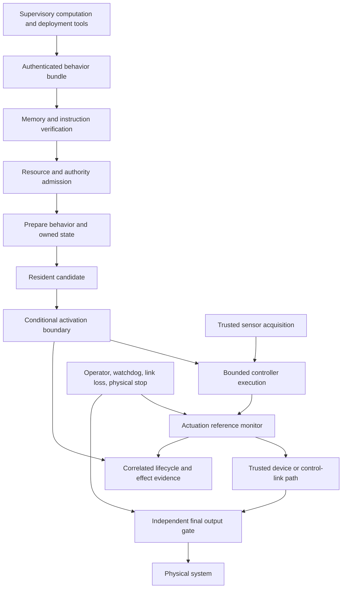
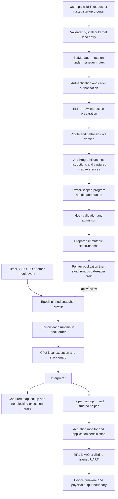
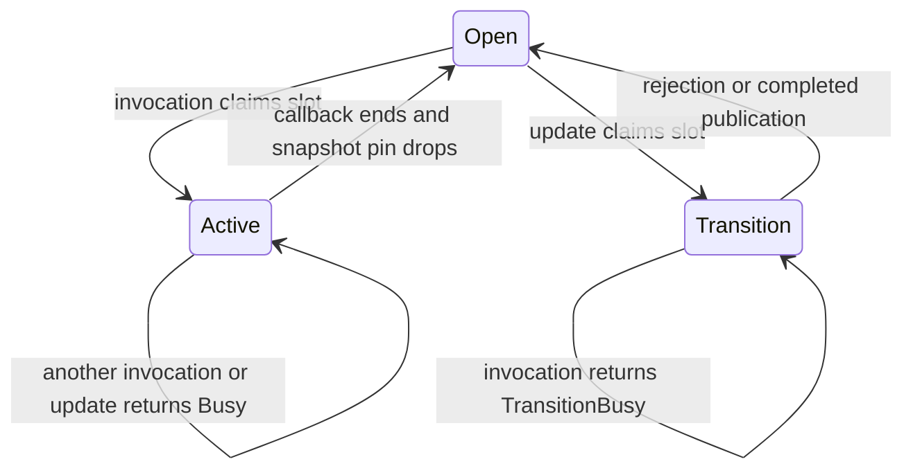
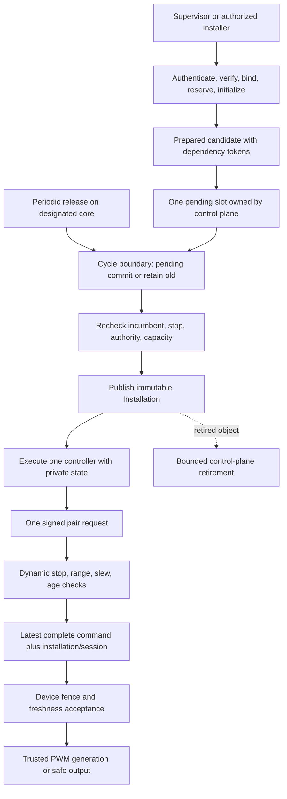
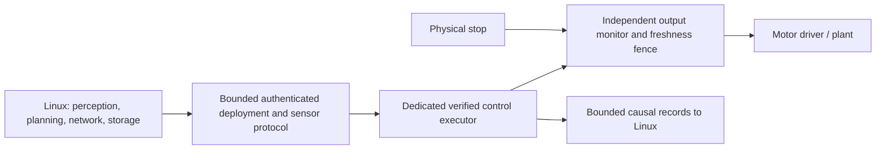

# axiomos: architecture, semantic drift, and a credible convergence path

## 1. Executive technical assessment

axiomos is currently a bare-metal Rust kernel containing a verified bytecode execution service and board-specific robot I/O. Its intended destination is a **trusted actuation plane**: admit bounded, authenticated controller behavior, execute it predictably, mediate every physical command, and permit controlled evolution without replacing the kernel image. These descriptions are related, but they are not equivalent.

There are two historical starting points. The inherited Muffin OS project explicitly pursued a general-purpose POSIX-oriented operating system in October 2025. The January 2026 Axiom pivot instead promised runtime-replaceable verified programs for embedded systems and robotics. The July architectural charter narrowed that ambition further: Linux should own general computing, while axiomos owns deterministic execution and actuation. Treating every inherited OS subsystem as an originally required robotics feature would erase this history. [H-origin] [H-pivot] [H-charter]

The five most consequential findings are:

1. **Several advertised architectural deficiencies have already been repaired.** The checkout has immutable `ProgramRuntime` objects, epoch-protected hook snapshots, per-CPU interpreter stacks, per-CPU run queues, generation-checked resource handles, and reclamation. Recommending a new read lock around every dispatch, per-event stack preallocation, or the first unload implementation would move backward or duplicate existing work. [C-runtime] [C-epoch] [C-context] [C-runqueues]
2. **The unit of deployment remains smaller than the intended behavior.** The primary implementation owns programs, maps, and attachments separately. It does not bind a behavior's artifact, private state, active role, installation identity, and downstream command authority into one production lifecycle. The paper branch supplies a useful conditional installation mechanism for one stateless TIMER slot, not this complete deployment abstraction. [C-runtime] [R-update]
3. **Atomic visibility, invocation exclusion, reclamation, and effect freshness are four different properties.** The checkout atomically publishes each hook-list mutation. The research gate additionally excludes participating invocations across replacement. Neither fact proves that an already queued predecessor command cannot later reach an actuator. Reclamation makes a pointer safe to free; it does not make a command current. [C-epoch] [R-gate] [P-paper]
4. **The paper demonstrates an availability tradeoff, not a universal safety or performance improvement.** At a 900 µs hold, hosted median-of-process-p99 scheduled-request publication latency is approximately 15.00 µs for quiescence-free publication and 21.887 ms for guarded replacement. In the 1,100 µs stress condition only 3 of 13 guarded logical requests complete. Its corrective replay also shows that delaying a corrective installation can worsen the simulated command exposure despite eliminating a retired command. These are retained host/simulation results, not Pi5 timing guarantees. [E-cost] [E-corrective]
5. **The architectural boundary requiring the most attention is execution-to-effect.** Verifier acceptance, authority mediation, command sign/range, link freshness, stop/rearm, final hardware enforcement, and evidence must agree end to end. A faster pointer exchange cannot repair a broken agreement between these layers. The primary hardware PR remains an open, explicitly gated software/HIL effort. [C-actuation] [C-link] [C-firmware] [H-pr35]

The implementation is therefore closer to the intended *execution substrate* than the README suggests, and farther from a complete *evolving robot controller* than a diagram containing “atomic publish” suggests. The shortest credible path retains the verified interpreter and existing ownership machinery, closes effect-boundary correctness, then prepares updates outside a small scheduled commit boundary. Detailed recommendations follow the reconstruction below.

### Evidence boundary

This review uses the following immutable reference points. “Current” means C unless explicitly qualified.

| Label | Source | Interpretation |
|---|---|---|
| C | `hil/v03-v04-20260720`, `4f5aa9037832b9ee27145c5ffc87f4c3ca707e18` | Primary checkout; runtime source unchanged by this review |
| R | `research/physworldai-2026`, `6db7fe7e5515df665234a0030de3419a8ccccc6e` | Paper implementation, inspected separately |
| R predecessor | `research/cl4fmagents-transactional-publication`, `505128c184c98e33ba02d8a9390c4f89baf632e1` | Same relevant BPF implementation; different paper packaging lineage |
| D | `release/v0.5.0-alpha.3`, `0567193e76283b82739b1348dcf8c727ccd9fc64` | Proposed design; not evidence that its lifecycle exists in C |
| P | `docs/papers/physworldai2026/who-guards-the-update.pdf` | Ten-page manuscript, SHA-256 `2ae864ac12215e4efb91a2591a052b4762df00f291ea821e18c8b4d37ffcff4b` |

**Evidence labels:** DI = documented intent; CP = behavior established by inspected code; HI = historical implementation/source; IN = inference. Performance findings separately use **measured**, **strongly inferred**, or **speculative**. A passing test establishes its exercised property, not unrestricted system correctness. Existing local reviews and untracked plans are explicitly treated as reviews/proposals rather than accepted contracts.

## 2. Intended architecture

### The evolution of the problem

| Period/source | Intended system | What the source actually establishes |
|---|---|---|
| October 2025, `4754923:README.md` | General-purpose x86-64 OS with POSIX aspirations, VM, processes, VFS, drivers | DI: the inherited substrate had a broader purpose than robotics |
| January 2026 proposal and `39a0840:README.md` | Runtime-programmable embedded kernel; replace verified driver/filter/safety/scheduling logic without reflash | DI: broad ambition. The same README lists wiring BPF into the running kernel as a next milestone, so its “complete” language is not integration evidence |
| May–June scope corrections | Load-bearing verification, provenance and timing admission rather than loosely connected BPF components | HI/DI: documents increasingly distinguish implementation from desired guarantees |
| July accepted runtime hardening | Immutable published execution views, explicit resource ownership, bounded CPU-local execution, safer syscall and scheduling boundaries | DI and CP: many mechanisms landed, including removal of per-fire stack allocation (`b42804c`), hook snapshots (`d00cd77`), and per-CPU queues (`5788f55`) |
| July actuation-plane charter | Small trusted deterministic execution and physical-effect authority, with general services on Linux | DI: a deliberate product narrowing, not a mandate to implement every historical OS feature |
| July proposed v0.5 design | Resident/active/retired behavior versions, conditional activation, retained rollback, version-private state, recording | DI, proposed: exact frozen private-state restoration is specified in one branch |
| September local v1 review | One qualified rover, one controller, fresh private state, explicit stop/rearm and bounded physical output | Review proposal: a simpler state policy, not an accepted reinterpretation of the older rollback contract |
| September manuscript | One-slot stateless conditional publication with observable exclusion/availability tradeoffs | R/P: a narrowed implemented research contract |

Historical evidence: [H-origin] [H-pivot] [H-v05] [H-charter] [H-v1-review]. Dates describe those source revisions, not publication or product acceptance dates.

### The intended model



The intended safety boundary is continuous. Verification controls what code may execute; capabilities control permitted operations; the reference monitor constrains actual requests; independent stop enforcement dominates behavior execution. A safety behavior loaded through the same programmable path cannot substitute for the independent stop mechanism. This distinction is explicit in the charter. [H-charter]

| Intended concern | Reconstructed invariant and lifecycle placement |
|---|---|
| Problem | Change useful robot behavior without reflashing, while retaining control over timing, authority, and effects |
| Execution | Small admitted programs consume trusted event/sensor contexts; the kernel owns scheduling and hardware mediation |
| Load | Authenticate executable content, parse/normalize, prove instruction/memory/helper properties, establish resource identity |
| Staging | Resolve stable dependencies, allocate private state, retain provenance, prepare the complete next execution view |
| Activation | Compare expected incumbent, recheck mutable authority/safety/capacity, publish a coherent installation or preserve the predecessor |
| Execution critical path | Observe current admitted installation, execute with bounded storage, validate genuinely dynamic effect conditions |
| State ownership | Kernel owns deployment continuity; private behavior state has a defined lifetime independent of accidental loader-process survival |
| Replacement | A managed control role has one authoritative installation; ordinary multi-hook fanout is a distinct facility |
| Rollback | Historically underspecified, later explicitly frozen private-state restoration, subsequently narrowed in a review to fresh-state reinstantiation |
| Concurrency | CPU-local execution where possible, shared immutable views, explicit ownership of control roles; kernel SMP does not imply multicore actuation publication |
| Authority | Installation permission and effect permission are separate; e-stop can invalidate effects independently of code validity |

**Inference:** the durable architectural objective is controlled transfer of actuation authority, not arbitrary live modification of the whole kernel. The later proposals are useful elaborations, but their incompatible state policies prevent treating one uninterrupted “original rollback invariant” as historical fact.

## 3. Current architecture

### Primary implementation



`BpfManager::execute_program` selects the interpreter directly. The presence of historical JIT source and optimistic README text does not change the accepted interpreter-only release policy. Ordinary dispatch borrows runtimes under an epoch guard; it does not acquire the manager mutex or clone an `Arc` for each invocation. Manager-mediated syscalls and helper-mediated execution are different access paths. [C-runtime] [C-epoch] [C-jit-policy]

Initialization establishes architecture and memory services, BPF management, VFS, IIO, CPU/scheduler state, platform devices and root storage. The Pi path also initializes simulated IIO infrastructure. Rootfs mounting and init creation are later than the early kernel metrics marker; the boot-success marker deliberately distinguishes these milestones. Boot instrumentation is not a sensor-to-actuator timing result. [C-init]

### Paper branch overlay



`SlotInstallation` co-locates runtime and `(program handle, installation epoch)`. `try_replace_exclusive_for` checks the complete incumbent identity; A→B→A therefore does not make an old request current again. The production path rejects map-bearing candidates and state transfer. Accounting and receipt updates complete inside one serialized manager operation, but they are not fields in the same atomic memory word as the published runtime. [R-update] [R-gate]

The transition gate is acquired **before** `prepare_exclusive_update` performs hook-context verification, map-metadata construction, admission preflight, and snapshot allocation. This is a key distinction between a function named “prepare” and work actually completed before execution is excluded. The current protocol intentionally proves a small returned-error contract; it does not yet minimize the exclusion interval. [R-update]

### Ownership and cost inventory

Notation: `n` instructions, `S` explored abstract states, `m` map slots, `k` maps leased by an invocation, `f` programs on a hook, `c` CPUs, `b` bytes copied. Bounds refer to configured capacities, not necessarily small constants.

| Subsystem | Purpose and invariant | Owned state; writers/readers | Dependencies and criticality | Complexity, synchronization and memory behavior |
|---|---|---|---|---|
| Syscall/user-copy boundary | Validate untrusted addresses, sizes, commands and credentials | Process credentials/FDs/address space; syscall mutators and task readers | VM and ABI; primarily deployment/control path | Page-bounded O(b) copying with mapper read guard; allocation depends on command |
| Loader/authentication | Turn admitted bytes into decoded instructions with provenance | Temporary parsed objects, signed input and verification metadata; manager writes | Signing, ELF parser, allocator; load path | O(input bytes) parsing/hash plus cryptographic and verifier work; multiple owned buffers |
| Verifier/admission | Reject illegal instructions, memory/helper use and over-budget work | Worklist, abstract register/stack states, pruning caches, WCET and resource ledger | Profile, context and map metadata; load/attach/update path | Path-sensitive cost depends on states and subsumption; explicit ceilings bound attempted verification work by rejection but do not prove general linear complexity |
| Program registry | Owner and generation-correct live resources | Program entries, handle generations, accounting; serialized manager mutates | Credentials, allocator, snapshots; control path | Indexed handle lookup; several scans for ownership, attachment and quota operations |
| Hook publication | Readers observe a complete hook list without registry traversal | Fixed-shape snapshot with retained runtime references; manager publishes, hooks borrow | Epoch implementation; reader path critical | O(1) route selection plus O(f) execution; writer reconstructs snapshot and waits for readers |
| Interpreter | Execute verified instructions with runtime bounds | Invocation registers/frames and borrowed CPU stack; executing core writes | Helper ABI and map leases; critical | O(executed instructions + helper costs); dispatch branches, stack clearing, explicit backstops |
| Maps | Authorized mutable state with valid returned-value lifetimes | `MapRuntime`, storage, grants and pins; manager plus leased execution paths | Program retention and nonblocking leases; helper path critical | Array indexing O(1); hash probing depends on occupancy; repeated lease membership O(k); map-specific locks/copies |
| CPU/scheduler | Exclusive task ownership and bounded queue operations | Per-CPU context and run queues, global sleep/cleanup structures | Architecture switch and interrupts; scheduling critical | Local queue lock, bounded steal; allocation excluded from switch preparation; remote wake notification incomplete |
| Actuation | Apply authority/range/rate/stop policy to each request | Monitor channel state/audit ring and application lock; effect/stop paths mutate | Time, GPIO/PWM/link drivers; critical | Short policy computation followed by potentially much longer serialized hardware/link work |
| Link/firmware | Transport commands and sensor data with loss handling | Pi parser/TX/liveness state; MCU control/configuration state; FPGA registers | UART, clocks, board wiring; end-to-end critical | Bounded frame handling but wire time O(frame bytes/baud); production MCU entry is distinct from library simulation |
| VM/allocator | Preserve physical-frame ownership and address-space isolation | Physical allocator/refcounts, page tables, virtual regions | Process lifecycle and load allocation; generally outside controller invocation | Global allocator locking; page walks/copies/shootdowns; failure rollback must precede releasing ownership |
| Audit/persistence | Explain decisions and preserve attributable evidence | Bounded volatile monitor ring; external capture files | Serialization, export/storage; decision append may be critical | Bounded ring overwrite is not a durable causal recorder; ext2 production writes are unsupported |

Sources: [C-runtime] [C-context] [C-runqueues] [C-usermem] [C-memory] [C-verifier] [C-actuation] [C-link] [C-firmware] [C-audit]. This table summarizes inspected paths; it does not certify every architecture/feature combination or every unsafe block.

### Global and cross-boundary mutable state

The [static declaration inventory](architecture-review-evidence/global-state-inventory.md) records 132 lexical Rust static declarations across 332 tracked Rust files and 86,775 lines in kernel, firmware and userspace, including nine explicit `static mut` declarations. These counts include tests, boot data, immutable constants and mutually exclusive architecture variants. They are not TCB size or a count of active production globals. Macro/dependency-generated globals and MMIO registers require separate treatment.

| State family | Exact representative objects | Sharing and required ownership |
|---|---|---|
| BPF control | `BPF_MANAGER`, `BpfManager::{programs,maps,attachments,gpio_routes,admission,pinned_maps}` | Serialized lifecycle/syscall mutations; runtimes retain selected references rather than consulting the whole manager |
| Published views | `HOOK_SNAPSHOTS`; R adds `TIMER_EXCLUSIVE_SLOT` and manager installation/receipt fields | Control writer, interrupt/core readers; version lifetime and installation identity are distinct |
| Map state | `MapRuntime`, `ProgramMapRuntime`, grants, pin entries, execution leases | Shared between eligible programs, manager operations and versions unless restricted; immutable references do not make contents immutable |
| CPU execution | `ExecutionContext`, interpreter stack and current execution pointer; `ONLINE_CPU_MASK`, `ONLINE_LAPIC_IDS` | CPU-local mutable execution with global online/topology metadata; migration and nesting rules matter |
| Task scheduling | `RUN_QUEUES`, `SLEEP_QUEUE`, `CLEANUP_QUEUE`, `CLEANUP_WORKER_SCHEDULED`, `PROCESS_TREE` | Per-CPU queue ownership plus shared lifecycle/wakeup structures |
| Actuation | `ACTUATION_MONITOR`, `APPLY_LOCK`, per-channel authority/rate state and audit ring | Behavior, syscall, stop and watchdog paths share physical authority |
| Device/link | `CONTROL_LINK`, UART/PWM instances, `IIO_MANAGER`, raw/block device registries | Core/IRQ/control-plane interactions; locks do not themselves create safe interrupt protocols |
| Memory | `PHYS_ALLOC`, `FRAME_REFS`, `RESERVED_REGIONS`, boot region arrays, `VMM`, `ALLOCATOR`, `KERNEL_ADDRESS_SPACE` | Boot initialization and shared process/resource allocation; explicit unsafe globals need initialization/lifetime arguments |
| Filesystem/platform | `VFS`, `DEVFS`, ACPI/IOAPIC/HPET cells, TLB epochs/ack arrays, DTB and boot page tables | Primarily trusted platform/control services, not behavior-private state |
| Evidence | IRQ/sample-ID atomics, syscall/scheduler/boot markers, link event counters | Build-feature-dependent instrumentation; synchronous emission can perturb the path being measured |
| MCU/FPGA | Control-loop fields, receive sequence/watchdog/configuration state, RTL validity/timer registers | Different processors and hardware clocks; CPU atomics cannot make their updates one local transaction |

The inventory deliberately separates initialization-once state from continuously mutable state. A single-writer device object still needs a policy for IRQ access, and per-core storage still needs an explicit rule preventing migration or reentrant use.

## 4. Intended vs current divergence

| Subsystem | Intended behavior | Current behavior | Divergence | Likely reason | Consequence |
|---|---|---|---|---|---|
| Product boundary | Small deterministic actuation plane; Linux supplies general services | Inherited process/VM/VFS/driver kernel surrounding BPF | Broader substrate than later product charter | HI: general-purpose origin; IN: reuse and bring-up convenience | Larger trusted surface and qualification effort; not evidence that immediate deletion is safe |
| Verifier | Load-bearing rejection of invalid behavior | Real path-sensitive verification and admission | Major positive convergence; assurance prose can overstate general bounds | Hardening history | Preserve verification; distinguish cost ceilings from proven WCET |
| Compilation | Prepared executable before publication if JIT exists | Interpreter-only shipped policy | Intentional restriction, not missing required optimization | Accepted ADR on JIT safety | Smaller executable-memory TCB; future JIT must justify itself |
| Execution preparation | No repeated lifecycle work in runtime dispatch | Immutable runtimes, CPU-local stacks, captured map references | Substantially achieved | July hardening | Many standard fast-path recommendations are already implemented |
| Deployment unit | Behavior identity, state, active role, history | Separate program/map/attachment objects | Missing lifecycle composition | Implementation grew around BPF APIs | Loader and map lifetimes do not define behavior continuity |
| Atomic replacement | Conditional old-or-new installation | C has separate attach/detach; R has exclusive stateless TIMER replacement | R closes only one slot boundary | Research deliberately scoped for testability | Ordinary fanout still lacks behavior-replacement semantics |
| Activation preparation | Candidate prepared before short commit | R re-verifies and allocates while transition gate is held | Execution exclusion includes control-plane work | IN: easiest serialized correctness argument | Longer possible service blackout; quantify separately from Busy delay |
| Rollback | D resumes frozen private state; later review proposes fresh state | C has no behavior rollback; R reselects retained stateless code with fresh epoch | Multiple targets, neither general state policy implemented | Deliberate research restriction and evolving product decisions | Do not claim preserved controller state or physical recovery |
| Authority | Installation authority and output authority remain valid at their boundaries | Owner/capability checks, retained authorization, monitor; no complete behavior-to-device generation contract | Local checks stronger than end-to-end composition | Separate subsystems evolved independently | Correct code may still issue an obsolete or misinterpreted effect |
| Stop/rearm | Independent stop dominance; fresh explicit restart | Kernel/firmware/RTL mechanisms with differing boundaries | End-to-end contract not established | Multi-device bring-up | Requires adversarial freshness, reset and final-output tests |
| Scheduling | Predictable control releases and bounded interference | General per-CPU scheduler; platform timer drives additional work | A control executor is not the same as a general timer hook | Reuse of kernel event machinery | Admission assumptions can diverge from actual event rates and service time |
| Multicore | Local fast paths, explicit cross-core ownership | Per-CPU stacks/queues but shared reader counters, maps and effect serialization | Partial convergence | Correctness-first shared structures | Potential contention; no current four-core RT proof |
| Reclamation | No stale readers, bounded resource lifetime | Real retention and synchronous reader-drain publication | Safe lifetime machinery can prolong management operations | Conservative reclamation | Stalled readers can block publication return; asynchronous reclamation needs its own memory bound |
| Auditing | Explain installed behavior, decisions and effects | Volatile monitor ring and external benchmark captures | No complete causal flight recorder | Measurement infrastructure preceded product recorder | Missing continuity, loss and applied-effect evidence |

Evidence is the source inventory in §3, historical sources in §2, and the narrower findings below. “Likely reason” is not attributed to an author unless history documents it.

## 5. Lifecycle analysis

### Primary path

| Transition | Work performed and state touched | Does it belong here? |
|---|---|---|
| Userspace → syscall | Copy/validate request and payload; check command, length and process rights; mapper read locking during user copies | Yes: trust-boundary checks cannot be replaced by caller promises |
| Input → authenticated bytes | Parse signed container, hash/verify according to configured provenance policy | Yes at installation preparation; preserve evidence of exactly what the signature covers |
| Bytes → instructions | ELF parsing, section/program selection, relocation/normalization and owned buffers | Yes at load; never event dispatch |
| Instructions → verified program | Profile/context/helper/map checks; abstract-state worklist and pruning; WCET metadata | Yes before execution; contextual attach proof may still be required |
| Verified → registered | Capture authorized referenced-map runtimes, allocate `Arc<ProgramRuntime>`, choose generational handle, charge resources | Yes control plane; identity and quota changes must reject atomically on failure |
| Registered → attached | Validate owner and hook; rebuild metadata and re-verify for context; reserve admission/route capacity; construct next snapshot | Prepare as much as possible before publishing; device-side installation must agree with success/error semantics |
| Attach → published | Publish immutable hook snapshot, change reader epoch, wait for old readers, reclaim old snapshot | Visibility and lifetime are correctly separated conceptually, but currently coupled in one synchronous call |
| Event → runtime | Pin snapshot using shared atomic counters, index route, iterate borrowed runtimes | Critical path; already avoids manager lookup and `Arc` ownership churn |
| Runtime → execution | Claim CPU-local stack/execution context, initialize interpreter invocation, run instructions | Necessary runtime work; investigate conservative clearing and lookup only after measuring |
| Execution → map access | Decode handle/generation and permission, acquire nonblocking map lease once per invocation, perform map operation | Lifetime/alias safety is necessary; stable map identities may be pre-resolved only with an equivalent proof |
| Execution → effect | Resolve helper, enforce request policy, serialize application, drive MMIO or transmit command | Dynamic envelope/stop/freshness checks remain here; blocking transport should not define interpreter execution time |
| Return/failure | Drop execution leases, clear CPU-local execution guard, unpin epoch; propagate or discard errors at callers | Cleanup belongs here; discarded actuation-relevant failures need an explicit stop/hold policy |
| Detach → unload | Publish removal, release admission, reject still-attached/referenced unload, reclaim program/map ownership and charges | Control path; resource accounting must follow actual lifetime, not merely disappearance from a registry |
| Owner exit | Detach owned resources and retry reclamation while live references remain | Memory-safe resource lifecycle; insufficient as a behavior-continuity policy |

Source: `BpfManager` load, attach, `run_snapshot`, `execute_program`, `unload_program_for`, `reclaim_owner`; `EpochSnapshot::{read,publish}`; `BpfExecution::{map,drop}`; syscall and effect adapters. [C-runtime] [C-epoch] [C-sysbpf] [C-actuation]

### Research replacement path

```text
already loaded candidate
  → reject unsupported state/candidate
  → claim OPEN → TRANSITIONING or return Busy
  → compare full expected installation and owner
  → check retained authentication, authority ceiling and conflicts
  → construct map metadata and re-verify TIMER context
  → preflight accounting and nonwrapping installation epoch
  → allocate complete SlotInstallation and receipt
  → acquire final clear-stop boundary
  → commit admission delta
  → publish runtime + installation identity
  → finish manager identity and receipt
  → release stop and transition guards
```

Returned errors preserve the predecessor publication, admission ledger, installation identity and receipt. A failed attempt can nevertheless exclude concurrent invocations and change diagnostic skip counters while it owns the transition gate. The gate excludes participating invocations, and the old snapshot pin is dropped before reopening. This is strong local structure worth retaining. However, successful preparation includes an instruction verifier and allocation *inside* invocation exclusion. Moving preparation earlier requires retaining its candidate and invalidating only facts that can change, not simply deleting rechecks. [R-update] [R-gate]

There is no physical rollback transition in either implementation. A previous command already delivered to a driver or device cannot be undone by restoring a program pointer. A new stop or compensating command is a new physical action with its own delivery and enforcement latency.

## 6. Critical paths

### Event dispatch and interpretation

`EpochSnapshot::read` loads the reader epoch, pins its counter using a compare-exchange loop, validates the epoch, then loads the current pointer. Successful return eventually decrements the reader counter. The uncontended logical path therefore includes several atomic loads, at least one read-modify-write to enter and one to leave; races add retries. It is **not** “one acquire load of an active pointer.” Counter overflow rejects instead of wrapping. [C-epoch]

Route selection is indexed; hook fanout is proportional to attached programs. Each invocation borrows a runtime, claims CPU-local scratch state, constructs an interpreter and an execution lease tracker, and executes. The primary manager lock is absent from this part of the path. `BpfExecution` contains 128 pointer slots, approximately 1 KiB of pointer payload on the 64-bit targets before other fields and alignment; map-heavy invocations scan already leased pointers. These are source-derived storage/cost observations, not measured bottlenecks. [C-runtime]

### Control update and reclamation

Ordinary attach/detach constructs and publishes a whole routing snapshot. Even a small route change can touch unrelated route storage and runtime references. `EpochSnapshot::publish` then synchronously spins until the previous reader counter drains. If a reader cannot progress, publication return cannot progress; the source explicitly warns against publishing while retaining one's own read guard. This is a lifetime constraint, not evidence that RCU requires indefinite work inside the application’s commit boundary. [C-epoch]

In R, cheap Busy rejection and successful publication have different costs. An unsuccessful gate claim avoids the verifier. A successful claim starts the longer preparation path while dispatch is excluded. Optimize and measure these intervals independently: request waiting, preparation, invocation exclusion, local publication, API completion, and downstream effect activation.

### Effects and hardware

The monitor's arithmetic can be cheap while effect delivery is expensive. UART time is approximately `10 × encoded_bytes / baud` for an 8-N-1 frame, before polling, queueing, parsing or device application. The current 11-byte motor frame takes about **0.955 ms at 115,200 baud**; two independent wheel-helper calls emit two pair frames, about **1.91 ms** of wire occupancy. A full 256-byte TX queue represents about **22.2 ms**. These are serialization calculations, not measured delivery latency. A nominal 1 ms interpreter admission period cannot by itself bound this effect path. [C-link]

| Path | Algorithmic cost | Memory cost | Synchronization cost | Runtime/hardware cost | Dominant concern |
|---|---|---|---|---|---|
| Tiny stateless hook | Route lookup + interpreter dispatch | Snapshot/runtime/instructions + scratch initialization | Epoch entry/exit and CPU-local guard | Interrupt entry/return and instruction execution | Measure fixed overhead; shared counter traffic may dominate at high core counts |
| Map-heavy hook | Instruction loop + probing + lease-membership scans | Map storage, keys/values, runtime metadata | Execution lease and map-specific synchronization | Helper calls and cache misses | Contention semantics and memory behavior, not manager lookup |
| GPIO effect | Policy arithmetic and route handling | Monitor/channel state | Application and driver serialization | Device MMIO and barriers | IRQ-safe ownership and physical endpoint latency |
| Link effect | Encoding + parser/consumer work | Frame buffer and command state | Link/application serialization | Wire serialization and device scheduling | Potentially millisecond delivery/interference |
| Attach/update | Metadata scans + contextual verification | Temporary metadata, abstract states, next snapshot | Manager/transition/stop boundaries | Allocator work and reader-drain delay | Exclusion interval and progress rather than atomic instruction speed |
| Stop | Latch, invalidate authority, force safe outputs | Monitor and device state | Stop/application ordering | Physical gate and device response | Must not depend on completing a controller update or ordinary queued command |

Cache-line touch counts need measured layouts and an identified core. Source provides a lower-bound object graph—snapshot bookkeeping → route entry → runtime → instructions/state → helper/device—not a calibrated cache-miss count. Shared atomic counters require cache-line ownership transfers under cross-core modification, but the number and cost of transfers are workload-dependent. No PMU result is claimed in this review.

## 7. Related-work landscape

### What problem to search for

Before assigning literature labels, the implemented research problem has at least four equivalent formulations:

1. **Conditional replacement of an exclusive event handler:** transfer one hook's execution authority while preserving expected-incumbent identity and rejecting stale requests.
2. **Quiescent dynamic software updating under a control deadline:** prevent predecessor invocations from crossing the local installation boundary without making corrective updates indefinitely unavailable.
3. **Versioned capability publication:** publish an executable with immutable identity, dependencies and authority metadata; serialize accounting and receipt updates in the same normal-return manager operation, and retire references safely.
4. **Distributed actuation-authority handoff:** prevent delayed effects from an obsolete controller from becoming authoritative at a separate device. This is an intended-system problem that the current local publication experiment does not solve.

The fourth formulation is why both dynamic-update research and output-side runtime assurance matter. A robotics agent framework sharing “runtime update” vocabulary is less useful than a lock-service paper that explains stale-request fencing.

### Technical areas and transfer limits

| Area / class | Relevant primary work | Concrete repository mapping | Transfer and important limit |
|---|---|---|---|
| Embedded extension runtimes — directly comparable | Femto-Containers (2022), µBPF (2024) | Interpreter, launch hooks, helper privilege, signed loading | Embedded eBPF is established; this repo must contribute control/update semantics rather than claim the VM concept |
| Embedded live updating — directly comparable | Retcon (2024), LITHE (2026 preprint) | R transition gate, installation, future state ownership | Prepare before handoff; define outstanding asynchronous work. Native/whole-application mechanisms do not automatically transfer to verified bytecode |
| Verifier assurance — mechanism/optimization | PREVAIL (2019), Verifying the Verifier (2023), SEV (2024), VEP (2025) | Abstract interpretation, pruning, retained verification evidence | Separate analysis precision, soundness validation and proof checking; none validates the current Rust verifier by association |
| Runtime/JIT assurance — mechanism | CertrBPF (2022), verified IoT JIT (2024), Jitterbug (2020), BRF (2024) | Interpreter, helper ABI, optional future JIT, lifecycle tests | A verified VM or compiler still requires correct helpers and effect mediation |
| Extensible kernels — architecture | KFlex (2024), Rex (2025), Tock (2017/2025) | Captured map authority, trusted helpers, resource cleanup | Precompute obligations; narrow trusted interfaces. Do not import broader loops/heaps or a trusted-extension threat model accidentally |
| Publication/reclamation — mechanism | Linux RCU, DPDK QSBR, libxdp; CIRC and Crystalline (2024) | `EpochSnapshot`, hook snapshots, deferred destruction | Lifetime progress and semantic exclusion are separate; complex reclamation is not the first repair |
| Temporal isolation — architecture | seL4 scheduling contexts (2018), PREEMPT_RT, SCHED_DEADLINE, ReTA (2023) | TIMER admission, per-core execution, helper accounting | Budget/period and preemption models must match actual platform events; neither admission nor observed percentiles proves WCET |
| Physical runtime assurance — architecture | Bb-Simplex (2022), SOTER (2019) | Monitor, trusted fallback, MCU/FPGA output | A safe baseline and switching condition depend on actual plant/model assumptions |
| Stale authority — mechanism | Chubby (2006), BPF link expected-old update | Installation epoch and command protocol | Recipient-side fencing is transferable; a distributed lock service is unnecessary for one robot |

Sources and full metadata for the closest work are in §8; additional important mechanisms follow here. Official implementation documents were accessed on 12 September 2026; moving `main`/`latest` pages describe that comparison, not a pinned ABI guarantee.

### Additional important work

Each row identifies a specific use, not merely a similar keyword. “Benefit/cost” is this review's qualitative estimate, not a published speedup.

| Work, authors, year and venue | Mechanism and exact target | Transfer, difference, benefit/cost, assumptions |
|---|---|---|
| [End-to-End Mechanized Proof of an eBPF Virtual Machine for Micro-controllers](https://link.springer.com/chapter/10.1007/978-3-031-13188-2_15), Shenghao Yuan, Frédéric Besson, Jean-Pierre Talpin, Samuel Hym, Koen Zandberg, Emmanuel Baccelli; CAV 2022 | Specification-to-C refinement for defensive VM; `execution/interpreter.rs` and unsafe host boundary | Strong assurance model, high cost; proof does not cover this Rust runtime or device helpers |
| [End-to-End Mechanized Proof of a JIT-Accelerated eBPF Virtual Machine for IoT](https://link.springer.com/chapter/10.1007/978-3-031-65627-9_16), Yuan, Besson, Talpin; CAV 2024 | Verified hybrid VM/JIT; future prepared executable | Potential CPU benefit, high cost; target ISA and proof chain differ; only after interpreter cost warrants JIT |
| [Simple and Precise Static Analysis of Untrusted Linux Kernel Extensions](https://vbpf.github.io/assets/prevail-paper.pdf), Elazar Gershuni, Nadav Amit, Arie Gurfinkel, Nina Narodytska, Jorge A. Navas, Noam Rinetzky, Leonid Ryzhyk, Mooly Sagiv; PLDI 2019 | Relational abstract domains; `verifier/{core,pruner}.rs` | Better analysis foundation, substantial redesign; Linux memory model is not the current profile's timing contract |
| [Verifying the Verifier: eBPF Range Analysis Verification](https://people.cs.rutgers.edu/~santosh.nagarakatte/papers/agni-cav2023.pdf), Harishankar Vishwanathan, Matan Shachnai, Srinivas Narayana, Santosh Nagarakatte; CAV 2023 | Check abstract/concrete range semantics; verifier arithmetic | High assurance value, medium cost; operation-level checks do not prove combined verifier soundness |
| [Validating the eBPF Verifier via State Embedding](https://www.usenix.org/conference/osdi24/presentation/sun-hao), Hao Sun, Zhendong Su; OSDI 2024 | Concrete-state assertions expose bad abstract approximations; verifier tests | High bug-finding value, medium cost; needs independent concrete interpreter/oracle and supported-state coverage |
| [VEP: A Two-stage Verification Toolchain for Full eBPF Programmability](https://www.usenix.org/conference/nsdi25/presentation/wu-xiwei), Xiwei Wu, Yueyang Feng, Tianyi Huang, Xiaoyang Lu, Shengkai Lin, Lihan Xie, Shizhen Zhao, Qinxiang Cao; NSDI 2025 | Expensive producer plus lightweight bytecode checker; install-time verification | High potential assurance/expressiveness value, high cost; do not remove local checking or assume annotations survive compilation correctly |
| [BRF: Fuzzing the eBPF Runtime](https://ics.uci.edu/~ardalan/papers/Hung_FSE24.pdf), Hsin-Wei Hung, Ardalan Amiri Sani; FSE 2024 | Generate accepted programs and exercise hooks/helpers/maps; manager lifecycle tests | High practical value, medium cost; requires axiomOS adapters and reachable-effect oracles |
| [Rex: Closing the Language-Verifier Gap with Safe and Usable Kernel Extensions](https://www.usenix.org/conference/atc25/presentation/jia), Jinghao Jia, Ruowen Qin, Milo Craun, Egor Lukiyanov, Ayush Bansal, Minh Phan, Michael V. Le, Hubertus Franke, Hani Jamjoom, Tianyin Xu, Dan Williams; ATC 2025 | Safe Rust interface plus runtime backstops; helper API | Useful typed host boundary, medium cost; trusted/non-adversarial native extensions differ from arbitrary signed bytecode |
| [Theseus: an Experiment in Operating System Structure and State Management](https://www.usenix.org/conference/osdi20/presentation/boos), Kevin Boos, Namitha Liyanage, Ramla Ijaz, Lin Zhong; OSDI 2020 | Explicit dependencies and reduced state spill; behavior/map ownership | High architecture value, medium cost; native OS replacement does not supply control-state validity |
| [Multiprogramming a 64 kB Computer Safely and Efficiently](https://tockos.org/assets/papers/tock-sosp2017.pdf), Amit Levy, Bradford Campbell, Branden Ghena, Daniel Giffin, Pat Pannuto, Prabal Dutta, Philip Levis; SOSP 2017 | Tock grants scope kernel-held process state to non-escaping access; map leases | High ownership value, medium cost; serialized kernel/process assumptions differ from multicore bytecode readers |
| [Timing Analysis of Embedded Software Updates](https://arxiv.org/abs/2304.14213), Ahmed El Yaacoub, Luca Mottola, Thiemo Voigt, Philipp Rümmer; RTCSA 2023 | Differential timing analysis; `verifier/cost.rs` admission evidence | Useful only with trustworthy platform timing model; high integration cost on cache-rich Pi5 |
| [Concurrent Immediate Reference Counting](https://doi.org/10.1145/3656383), Jaehwang Jung, Jeonghyeon Kim, Matthew J. Parkinson, Jeehoon Kang; PLDI 2024 | Combine epochs with prompt reference decrements; snapshot ownership | Low immediate benefit/high cost for a bounded slot; general heap management exceeds current need |
| [A Family of Fast and Memory Efficient Lock- and Wait-Free Reclamation](https://doi.org/10.1145/3658851), Ruslan Nikolaev, Binoy Ravindran; PLDI 2024 | Crystalline reclamation variants; stalled-reader memory progress | Conditional benefit/high proof cost; does not make an unfinished controller invocation safe to overlap |
| [SOTER: A Runtime Assurance Framework for Programming Safe Robotics Systems](https://arxiv.org/abs/1808.07921), Ankush Desai, Shromona Ghosh, Sanjit A. Seshia, Natarajan Shankar, Ashish Tiwari; DSN 2019 | Composable advanced/safe controller modules; output monitor | High conceptual value/high application cost; model/environment assumptions must be explicit |
| [The Chubby lock service for loosely-coupled distributed systems](https://research.google/pubs/the-chubby-lock-service-for-loosely-coupled-distributed-systems/), Mike Burrows; OSDI 2006 | Recipient validates sequencer/generation to reject stale authority; Shrike command sink | High value/medium protocol cost; borrow fencing only, not consensus or lock-service deployment |
| [Specification and Verification in the Field](https://www.usenix.org/conference/osdi20/presentation/nelson), Luke Nelson, Jacob Van Geffen, Emina Torlak, Xi Wang; OSDI 2020 | Jitterbug symbolic translation checks; future architecture-specific JIT | High assurance value/high cost; assumes accepted bytecode and modeled prologue/helper interfaces |

SafeBPF's [2024 preprint](https://arxiv.org/abs/2409.07508) is a useful defense-in-depth comparator, but its hardware MTE path is not available on Pi5's Cortex-A76 or RP2040. [BeePL](https://arxiv.org/abs/2507.09883) is a 2025 correct-by-compilation preprint worth revisiting if a restricted authoring language becomes a product requirement. Neither is a reason to replace the working interpreter now.

### Search coverage and negative results

The search covered ACM/IPSN/Middleware/SOSP/PLDI/FSE/eBPF, USENIX OSDI/NSDI/ATC, IEEE RTCSA/DSN, CAV/RV, arXiv, and official Linux/DPDK/Tock/seL4/xdp-project sources. Queries included embedded eBPF, asynchronous quiescence, controller hot swap, verifier proof/fuzzing, guarded publication, runtime assurance, RT Linux robotics, and bounded reclamation. Backward/forward searches followed Femto-Containers, Retcon, Theseus, PREVAIL and Simplex. Publisher access gaps were filled with author manuscripts and primary artifacts; some newer entries were assessed from primary abstracts rather than full proofs. This was not an exhaustive census of every named venue, Google Scholar or Semantic Scholar index.

Production evidence is strongest in Linux, DPDK, libxdp, Tock's deployment report and Google's Chubby. No equally direct verified mechanism was established from vendor marketing or agent-OS descriptions. io_uring, cloud orchestration, storage/VLDB, and generic AI-agent papers were not elevated without a concrete match to these code paths. LITHE remains explicitly a preprint; a claimed IROS submission is not an accepted-paper citation. This avoids manufacturing a 2026 peer-reviewed landscape from search-result dates.

## 8. Top 10 closest papers/systems

Ranking weighs actual mechanism overlap with the selected robotics objective, not venue prestige or recency.

1. **[LITHE: A Real-Time Robotics Control Architecture for AI-Generated Control Policies](https://arxiv.org/abs/2603.07442), He Kai Lim and Tyler R. Clites, 2026, arXiv v1, 8 March; IROS submission stated, acceptance unconfirmed.** Direct architecture comparator: Pi robotics, isolated periodic C++ controller, off-path native loading and cycle-end pointer handoff. Maps to R preparation and TIMER execution. Transfer: prepare before exclusion and separate supervisory work; benefit high, difficulty medium. Its Linux/native/shared-state model and functional real-time evidence do not establish verified-bytecode or physical-freshness guarantees.
2. **[Femto-Containers: DevOps on Microcontrollers with Lightweight Virtualization & Isolation for IoT Software Modules](https://arxiv.org/abs/2210.03432), Koen Zandberg, Emmanuel Baccelli, Shenghao Yuan, Frédéric Besson, Jean-Pierre Talpin, Middleware 2022.** Direct embedded VM antecedent: small event-triggered eBPF modules, host bindings and deployment. Maps to interpreter/hooks/private storage. Reuse its narrow deployment boundary; benefit high, implementation cost low to medium. RIOT isolation is not exclusive multicore controller replacement or actuator authority.
3. **[Retcon: Live Updates for Embedded Event-Driven Applications](https://people.eecs.berkeley.edu/~prabal/pubs/papers/watson24retcon.pdf), Jean-Luc Watson, Saharsh Agrawal, Ryan Tsang, Sherry Luo, Raluca Ada Popa, Prabal Dutta, IPSN 2024.** Direct update comparator: derives asynchronous quiescence and state transfer. Maps to `prepare_exclusive_update` and future stateful rollback. Readiness must account for outstanding operations, not only stack readers. Benefit high, cost high; transfer requires analyzable callbacks/state transformations, unlike R's deliberately stateless slot.
4. **[µBPF: Using eBPF for Microcontroller Compartmentalization](https://marioskogias.github.io/docs/microbpf.pdf), Szymon Kubica and Marios Kogias, eBPF workshop at SIGCOMM 2024.** Direct deployment/authority comparator: MCU eBPF, signed delivery, JIT and privilege-specific helper access. Maps to signed loading and effect helpers. Narrow capability binding transfers at medium cost; JIT does not transfer without timing/translation assurance. Its deployment threat model and peripheral mediation do not define quiescent controller epochs.
5. **[Fast, Flexible, and Practical Kernel Extensions](https://rs3lab.github.io/assets/papers/2024/dwivedi:kflex.pdf), Kumar Kartikeya Dwivedi, Rishabh Iyer, Sanidhya Kashyap, SOSP 2024 (KFlex).** Mechanism comparator: interface compliance and precomputed cancellation/resource obligations. Maps to captured maps/helpers and `BpfExecution`. Benefit high, cost medium for preparation metadata. Broader loops/state and SFI assumptions are not appropriate defaults for bounded TIMER control.
6. **[Linux sched_ext](https://github.com/torvalds/linux/blob/master/Documentation/scheduler/sched-ext.rst), Linux kernel contributors, official implementation documentation, accessed 2026.** Operational comparator: one active BPF policy, enable sequence, transition bypass, watchdog and trusted scheduler fallback. Maps to exclusive TIMER custody and failure reporting. High-value medium-cost transfer: explicit fallback and transition telemetry. Task scheduling permits recovery semantics different from irreversible actuation; API stability is not promised.
7. **[Tock: From Research to Securing 10 Million Computers](https://tockos.org/assets/papers/2025-sosp-tock-decade.pdf), Leon Schuermann, Brad Campbell, Branden Ghena, Philip Levis, Amit Levy, Pat Pannuto, SOSP 2025; complemented by [Tock grants, SOSP 2017](https://tockos.org/assets/papers/tock-sosp2017.pdf).** Architecture/production comparator: trusted capability minting and scoped process-state access. Maps to output authority and non-escaping map leases. High-value medium-cost typed boundaries; static trusted board assembly and serialized grant assumptions differ from multicore bytecode readers.
8. **[Linux RCU](https://www.kernel.org/doc/html/latest/RCU/whatisRCU.html) and [DPDK QSBR](https://doc.dpdk.org/api/rte__rcu__qsbr_8h.html), respective project contributors, official living documentation, accessed 2026.** Mechanism comparator: publish independently of deferred freeing, explicit reader quiescence and registration. Maps directly to `EpochSnapshot`. High potential tail-latency value, medium-to-high proof cost. A stalled registered reader still delays reclamation; neither provides exclusive effects or a bounded controller duration.
9. **[Scheduling-Context Capabilities: A Principled, Light-Weight OS Mechanism for Managing Time](https://trustworthy.systems/publications/full_text/Lyons_MAH_18.pdf), Anna Lyons, Kent McLeod, Hesham Almatary, Gernot Heiser, EuroSys 2018.** Architecture comparator: explicit budget/period authority and timeout faults. Maps to TIMER admission and helper accounting. High potential temporal clarity, high engineering cost if imported into the scheduler. Reservation is not WCET proof; all charged work and blocking must be modeled.
10. **[A Barrier Certificate-Based Simplex Architecture with Application to Microgrids](https://www3.cs.stonybrook.edu/~stoller/papers/rv2022.pdf), Amol Damare, Shouvik Roy, Scott A. Smolka, Scott D. Stoller, RV 2022.** Output-boundary comparator: trusted switching decision plus safe baseline after advanced control. Maps to `ActuationMonitor` and FPGA/MCU. High semantic value, high application-specific cost. Its barrier/model assumptions cannot be replaced by bytecode verification or a duty clamp; use it to define what a physical safety claim would require.

## 9. Architecture comparison matrix

| System | Year | Problem | Architecture | Key mechanism | Our equivalent | Advantage over us | Transferable idea |
|---|---:|---|---|---|---|---|---|
| Femto-Containers | 2022 | Small deployed IoT modules | RIOT + eBPF VMs | Fixed launch points and isolated storage | Interpreter/hooks/maps | Integrated constrained deployment model | Narrow behavior contract |
| µBPF | 2024 | MCU compartments | VM/JIT + deployment pipeline | Privilege-specific bindings | Signed load/helpers | Explicit deployment/compartment integration | Bind approved helpers before activation |
| Retcon | 2024 | Event-driven live updates | Compiler + runtime | Asynchronous quiescence/state transfer | R gate/state rejection | Accounts for application update points | State/async readiness contract |
| LITHE | 2026 preprint | Adaptive robot control | Isolated Linux control spine | Off-path loading, cycle-end handoff | TIMER update | Separates preparation from control cycle | Dedicated executor with prepared candidates |
| KFlex | 2024 | Flexible kernel extensions | Static interface proof + runtime isolation | Precomputed cleanup obligations | Captured maps/leases | Explicit split of proof responsibilities | Immutable bindings and cleanup metadata |
| sched_ext | Living | Replaceable scheduling policy | Trusted kernel + BPF policy | Watchdog, bypass, fallback | Exclusive slot | Operational failure recovery is first-class | Trusted fallback and monotonic installation |
| libxdp | Living | Packet-program composition | Prepared dispatcher | Frozen configuration and atomic replacement | HookSnapshot | Explicit build/swap/teardown protocol | Finish construction before publication |
| Linux livepatch | Living | Native code fixes | Per-task consistency | Safe-point convergence | R exclusion | Maintains service while tasks transition | Counterexample: coexistence may be intentional |
| RCU / DPDK QSBR | Living | Safe shared-object replacement | Readers + deferred retirement | Grace period after publication | EpochSnapshot | Mature participation/retirement contracts | Separate commit from free |
| Tock | 2017/2025 | Embedded isolation | Rust capsules/processes | Grants and minted capabilities | Map leases/helper authority | Typed trusted boundary and deployed experience | Non-escaping borrowed state |
| seL4 MCS | 2018 | Temporal authority | Microkernel scheduling contexts | Budget/period capabilities | Admission metadata | Time is an explicit resource object | Account complete execution budget |
| VEP | 2025 | Rich verified extensions | Producer/compiler/checker | Small on-device proof checker | Verifier | Separates expensive proof production | Keep checking local, preparation remote |
| Simplex/SOTER | 2022/2019 | Safe advanced control | Decision module + baseline | Output-side safety switch | Monitor/gate | Plant-level contract beyond program validity | Specify fallback and safe set |
| Chubby | 2006 | Stale distributed authority | Lock service + participating sink | Sequencer checked by recipient | Installation epoch | Delayed request rejection at effect receiver | Carry and validate command generation |

Primary citations are in §§7–8; [libxdp protocol](https://github.com/xdp-project/xdp-tools/blob/main/lib/libxdp/protocol.org) and [livepatch consistency](https://docs.kernel.org/livepatch/livepatch.html) supply the two additional implementation comparisons. “Advantage” identifies a mechanism this repository lacks or has not established, not a cross-platform benchmark win.

Independent convergence is strongest around **prepare before publication**, **explicit ownership**, **separate lifetime from visibility**, and **a trusted fallback outside replaceable policy**. There is no equivalent consensus that all updates must globally quiesce: Linux livepatch intentionally permits coexistence. The correct choice follows effect semantics, not the popularity of RCU.

## 10. Bottlenecks

### What was actually measured

The manuscript verifier was rerun successfully. It checked retained provenance and regenerated paper tables from raw records; it did not run new controllers or hardware. Independently, all three measured hosted binaries matched the recorded hashes. Each capture retained 761 source files. Comparison to R found eleven changed paper/renderer files and **no changed runtime, benchmark harness or reducer sources**. The measured revision was `1e6e6d1` plus its retained patch, not a clean binary built from `6db7fe7`. [E-verification] [E-source-check]

| Hold (µs) | Atomic: median of process medians / median of process p99s (µs) | Guarded: median of process medians / median of process p99s (µs) | Guarded logical completions / starts |
|---:|---:|---:|---:|
| 0 | 8.515 / 15.617 | 8.495 / 15.808 | 9,992 / 9,992 |
| 10 | 8.572 / 13.653 | 8.510 / 1,144.073 | 9,895 / 9,895 |
| 100 | 8.513 / 13.070 | 8.758 / 1,147.212 | 8,976 / 8,977 |
| 500 | 7.982 / 14.516 | 9.056 / 4,560.697 | 4,950 / 4,955 |
| 900 | 6.169 / 14.999 | 6,833.076 / 21,887.128 | 984 / 993 |
| 1,100 | 12,410.297 / 29,799.711 | 334,943.518 / 334,943.518 | 3 / 13 |

Metric: **scheduled logical request → publication**, not pointer-swap duration. Each protocol/hold uses ten processes with 1,000 measured attempts after warmup. Guarded retries consume attempts, so equal attempt counts do not produce equal populations of logical requests. At 1,100 µs, only three guarded processes have completions; the displayed conditional quantiles are therefore poor summaries of availability. Atomic completes 10,000 requests in each hold condition. [E-cost]

The causal result is strong: long occupied intervals leave fewer successful guard windows, retries age requests, and service can be skipped. It is not simply “the gate adds 21 ms.” At 1,100 µs, the atomic median of process first-call-to-publication medians remains 1.11 µs while scheduled-to-publication becomes millisecond-scale: synchronous post-publication reader drain/backlog can also hurt freshness. Zero-hold observer medians of 181 ns versus 200 ns describe the hosted observation harness, not an intrinsic 19 ns bare-metal gate cost.

Replay independently records retired-command schedules: 0, 4, 24 and 44 of 50 phases for quiescence-free publication at holds 0, 100, 500 and 900 µs; guarded replacement records none. Neither records old/new overlap in this primary grid. Therefore **retired output and overlap are different observables**. At 1,100 µs, all fifty atomic schedules overlap and all fifty guarded schedules skip service. The guard also excludes simultaneous same-generation invocations; the compared protocols differ in steady-state admission, not only replacement. [P-paper]

### Ranked causal concerns

| Rank | Issue / exact location | Why the code has it; cost mechanism | Exposing workload | Evidence class |
|---:|---|---|---|---|
| 1 | R `try_update_exclusive_for`, `prepare_exclusive_update` | Strong exclusion serializes verifier/metadata/allocation with control service; Busy retries delay logical updates | High controller occupancy, corrective update during long invocation | **Measured** hosted/replay availability loss; placement's independent contribution is strongly inferred |
| 2 | `control_link::{set_motor,service}`; `actuation::guard_motor_with` | Framed serial effect transport and two independent wheel submissions; wire serialization, stale FIFO backlog | Frequent paired commands, full queue, link fault | **Strongly inferred**, exact wire-budget calculation; no new physical timing |
| 3 | `EpochSnapshot::publish` and manager callers | Synchronous safe reclamation waits while management lock remains held; some cleanup paths mask IRQs | Slow/stalled reader concurrent with attach/unload/exit | **Code-established dependency**, measured only in hosted comparison; target contention unmeasured |
| 4 | `APPLY_LOCK`, `CONTROL_LINK`, stop/bench serial printing | Serializes policy and effects; blocking UART under IRQ masking extends interference | Stop during output, logging enabled, interrupt storms | **Strongly inferred** tail/IRQ risk; target duration unmeasured |
| 5 | `run_snapshot` and ignored production results | First error aborts fanout; errors often discarded, obscuring loss of control service | Map lease conflict, helper failure, early observer failure | **Code-established failure behavior**, latency/availability consequence workload-dependent |
| 6 | `EpochSnapshot::read` shared counters | Every reader modifies common cache lines; retries/coherence under SMP | Several cores firing unrelated hooks | **Strongly inferred** mechanism; scalability bottleneck unmeasured |
| 7 | `BpfExecution::map`, `MapRuntime` lease | Whole-invocation exclusive lease protects escaping raw value pointer; O(k) membership per access | Shared hot map, long invocation, read-mostly access | **Strongly inferred** rejection/scan cost; do not remove lifetime protection |
| 8 | `HookSnapshot`, `publish_hook_snapshot` | Entire fixed route object rebuilt for a small mutation; reference acquisition and allocator traffic | Rapid ordinary attach churn, many occupied routes | **Code-derived** O(routes + attachments), practical importance unmeasured |
| 9 | Interpreter dispatch/helper decoding | Bytecode dispatch branches, runtime checks, stack initialization | Compute-heavy controller with few effects | **Speculative** as dominant cost; no target instruction/PMU profile |
| 10 | Verifier worklist/pruner | Branch-dependent state enumeration; fixed ceilings can reject complex valid input | Adversarial branch diamonds/incomparable abstract states | **Code-derived admission concern**, not a runtime bottleneck |

The first ranked issue has the strongest experiment behind it. Correctness repairs in §11 can outrank it operationally even without a performance measurement.

### Benchmark quality and scope

The hosted captures pin observer/writer to distinct Ryzen 7735HS physical cores (logical CPUs 12 and 14), use a performance governor with boost enabled, and retain scheduler perturbation. The wait helper sleeps until roughly the final 50 µs for sufficiently distant deadlines, then spins. This is not interrupt-disabled Pi execution. Warmup, a tiny stateless candidate and warm metadata favor steady-state microbenchmarks. Ten process repetitions help, but p999 and rare-fault behavior remain unresolved; startup, failed/unfinished requests and successful-request quantiles need separate denominators.

The replay uses a shared fine event mesh, predetermined gain changes and clipped output. Its zero bound violations largely follow the imposed saturation; that is not evidence of a safe robot. In the corrective case, the guarded update arrives 1,137 µs later, removes one retired command, but increases simulated fault-horizon command exposure from 0.200 to 2.100 command-ms and delays stop-band entry by about 1.9 ms. This contradicts any claim that less retired execution necessarily gives safer correction. [E-corrective]

Historical hardware figures are **provisional**: PR35 records an MC latency around 4.5 µs against a sub-1 µs target, a single physical-edge observation, and limited containment trials. They do not qualify the current full path. The repository provenance checker identifies one attributable hosted verifier campaign and one provisional evidence set; archived QEMU/timer-conversion numbers should not be promoted to current performance claims. [H-pr35] [E-provenance]

## 11. Semantic drift

These are correctness or contract findings before they are optimization opportunities. Source-established behavior is distinguished from a proposed physical invariant.

| Finding | Exact evidence | Consequence and smallest credible correction |
|---|---|---|
| Signed motion becomes unsigned policy input | `kernel/src/actuation.rs:253`, `guard_motor_with` uses `unsigned_abs`; `kernel/crates/kernel_bpf/src/actuation/mod.rs:610`, `decide` compares unsigned previous/output values | `+90 → -90` appears as `90 → 90`, defeating a signed-motion interpretation of `max_step`. Define signed slew at the shared motor boundary, with overflow-safe arithmetic and zero-crossing tests |
| A wheel pair is two externally visible updates | `kernel/crates/kernel_bpf/src/behaviors.rs:61`; `control_link.rs:289`, `set_motor` | `(L2,R1)` is queued before `(L2,R2)`; failure after the first call leaves a mixed command. Provide one atomic pair request with one policy decision and one enqueue |
| Heartbeat liveness refreshes old motion | `kernel/crates/shrike_link/src/watchdog.rs:75`, `on_msg`; `kernel/crates/shrike_link/src/watchdog.rs:114` | Heartbeats can retain old drive; timeout evaluation does not irreversibly disarm, so a later heartbeat can revive it. Separate peer liveness from command age and latch timeout-disarm until a fresh command |
| FPGA release restores retained validity | `firmware/shrike/fpga/forgefpga/ffpga/src/{top.v,shrike_safety_gate.v}` | Low e-stop suppresses output, but release can pass the still-valid command. Clear command validity on stop and require a subsequent fresh command under the defined restart protocol |
| Checked duty metadata does not bound the waveform | `shrike_safety_gate.v:1` ANDs external PWM with validity/range | A low allowed duty field can accompany continuously high PWM. Generate PWM from checked command inside the trusted gate, or independently validate actual waveform; the existing AND gate only enforces enable/disable |
| Installation epoch stops at the CPU | R `InstallationId`; `kernel/crates/shrike_link/src/lib.rs:37` frame format | Eight-bit sequence/CRC has no installation, boot/session or age identity. Specify a sink-side fence and freshness rule; CRC protects corruption, not malicious authority |
| ELF object-local identity becomes manager identity | `loader/mod.rs:113`, `loader/reloc.rs:234`; `kernel/src/bpf/mod.rs:1004` | Loader emits local map indexes, manager ignores object map definitions and takes first entry. Local map zero can resolve against reserved global map zero or reject. Reject map-bearing/multiple-entry ELF until transactional object binding exists |
| PWM attach success can misstate endpoint installation | `kernel/src/syscall/bpf.rs:389`, PWM handling at `489` | Attachment is published before endpoint handling; narrowing casts and warning-only invalid endpoints permit misleading success. Validate supported endpoint semantics before any mutation; reject unsupported endpoint attachment |
| Generic failure suppresses later work | `kernel/src/bpf/mod.rs:1549`; R timer dispatch at `2319` | `?` stops fanout and callers discard errors; ordinary TIMER fanout precedes exclusive dispatch in R. A failed observer can suppress a controller. Separate observer failure policy from exclusive actuation and record bounded failures |
| Recorded decision is not recorded application | `kernel/src/actuation.rs:193`; `actuation/audit.rs:5` | Allow/Clamp is logged before queue acceptance, with no correcting record on enqueue failure. Distinguish policy decision, enqueue, sink acceptance and application; declare losses |
| Claimed analysis bound is stronger than its proof | `docs/security/verifier-assurance.md:34`; `verifier/core.rs:366`, `pruner.rs:242` | Finite lattice height bounds chains, not the number of incomparable path states. Current caps bound rejection/resources, but do not justify the stated universal linear exploration bound. Correct the claim and test branch families |
| Timing admission model and execution configuration diverge | `verifier/cost.rs:1`; `profile/mod.rs:245`; `kernel/src/bpf/mod.rs:417`; AArch64 `interrupts.rs:213` | Cost constants describe earlier A76 JIT calibration while current runtime interprets; nominal 1 kHz admission is not the generic timer's actual 100 Hz cadence. Recalibrate and describe structural admission separately from end-to-end timing |

The source-linked counterexamples reproduced two heartbeat/timeout witnesses, two FPGA validity/waveform witnesses and one measurement-denominator witness. The safety witnesses were checked against Rust/RTL. Signed-slew and mixed-pair findings are source-derived, not newly executed counterexamples. Those executable models are **not physical-device trials** and do not prove deployed FPGA behavior. Existing Rust and official RTL simulations also pass; their asserted contracts omit or intentionally allow some of these behaviors. Passing tests and a contract defect can coexist. [E-safety-tests]

Important counterevidence prevents overstatement:

- Production unsigned loading is disabled except explicit test/development builds; malformed signed containers still fail. Child capabilities are intersections, not ambient privilege amplification. The signed loader currently receives load/read rights, not device-attach or actuation rights. This is fail-closed but leaves a production provisioning gap. [`credentials.rs`](../../../kernel/src/mcore/mtask/process/credentials.rs#L25), [`init`](../../../userspace/core/init/src/main.rs#L184), [`trust`](../../../kernel/src/bpf/trust.rs#L1).
- C discards signer provenance after authentication; R retains authentication for commit checks. Unsigned header flags/time are not currently used to grant authority, so their lack of signature coverage is a future signed-policy hazard, not a demonstrated current authorization bypass. [`signing/verifier.rs`](../../../kernel/crates/kernel_bpf/src/signing/verifier.rs#L123).
- The MCU library clears arming on e-stop and requires a new setpoint after release. The defect is not “every stop path is broken.” The FPGA and heartbeat-timeout contracts differ from that stronger rule.
- Actual RP2040 `main` is intentionally fail-safe and inert: it does not run the simulated control loop, `VALIDATED_FPGA_ARTIFACT` is absent, and `fpga-runtime` deliberately fails compilation. That is an honest hardware qualification gate, not evidence of an operational rover. [`main.rs`](../../../firmware/shrike/rp2040/src/main.rs#L1).
- Local `apply_safe_drive` writes RP1 PWM even for link-owned channels. Remote containment depends on the stop protocol, timeout and physical gate; its return value does not confirm remote application. [`actuation.rs`](../../../kernel/src/actuation.rs#L88).
- Map leases, generation checks, monotonic child rights, nonwrapping installations, bounded quotas and safe frame ownership are genuine improvements. Deleting them to shorten the path would weaken the intended system.

## 12. Optimization roadmap

Correctness is a veto before the requested `impact × confidence / engineering cost` ranking. Scores below are ordinal review aids: impact 1–5, confidence 0.25/0.5/0.75/1, cost 1/2/3/5. They are not estimated speedups. A high score cannot justify bypassing a prerequisite.

| Change | Class / score | Target cost | Semantic effect | Expected performance effect | Confidence | Cost / risk | Evidence chain |
|---|---|---|---|---|---|---|---|
| One signed motor-pair transaction | Restoration; 5×1/2 = 2.5 | Two policy/application/enqueue paths and two wire frames | No mixed pair; signed slew becomes meaningful | Exactly two→one frames for paired update, about 1.91→0.955 ms wire occupancy; CPU saving unmeasured | High | Medium; helper/ABI compatibility | Pair callers + `set_motor`; Simplex output boundary |
| Command-age watchdog and stop/rearm invalidation | Restoration; 5×1/2 = 2.5 | Stale FIFO/heartbeat-driven authority | No heartbeat revival; stop release cannot silently reauthorize | Direct CPU benefit small; potentially large reduction in stale-command exposure | High semantics, medium timing | Medium across devices; reset races | Watchdog/RTL witnesses + Chubby fencing/runtime assurance |
| Reject unsupported ELF composition and invalid endpoints | Restoration; 4×1/1 = 4 | Wasted parse/verify/publication and ambiguous failures | No accidental object/global alias or false attach success | Negligible normal runtime; shorter failed installation | High | Low; rejects previously ambiguous inputs | Loader/manager mismatch + libxdp complete-before-publish |
| Defer serial formatting/transmission out of masked locks | Fast path; 4×0.75/1 = 3 | UART busy waits and formatting interference | Restores bounded interrupt work; bounded loss counters preserve observability | Median possibly small; long IRQ-disabled tails could shrink substantially | High mechanism, unmeasured magnitude | Low–medium; dropped-log visibility | Serial/apply callers + PREEMPT_RT allocation/IRQ discipline |
| Fully prepare exclusive candidate before gate | Convergence; 5×0.75/3 = 1.25 | Re-verifier, vectors, allocation during exclusion | Short commit with equivalent mutable rechecks | Shorter successful blackout; does not by itself eliminate Busy starvation | High direction | Medium–high; stale-proof/TOCTOU risk | R source + LITHE/libxdp/KFlex |
| Scheduled single-owner commit | Architecture; 5×0.75/3 = 1.25 | Opportunistic gate retries and release collisions | Explicit cycle boundary and controller custody | Potentially millisecond-to-cycle-scale update aging under bounded occupancy; no unconditional bound | Medium | Medium–high; overrun policy | Hosted holds + LITHE/seL4 |
| Deferred bounded reclamation | Architecture; 4×0.75/3 = 1 | Synchronous drain under manager lock | Visibility separated from actual resource retirement | Large possible management-tail reduction with slow readers; normal execution little changed | High mechanism | High lifetime proof; retained memory | `EpochSnapshot` + RCU/QSBR |
| Separate observer failure from controller dispatch | Restoration; 4×1/2 = 2 | Silent fanout starvation | Observability error cannot suppress exclusive control; actuation fault still fails safe | Better service availability, not necessarily faster invocation | High | Medium; failure-policy errors | `run_snapshot` + sched_ext fallback |
| Bind sparse program map references | Low risk only after proof; 2×0.5/2 = 0.5 | Slot-sized vectors and lease scans | Same captured identity/permissions | Less metadata when global map table ≫ referenced maps; lookup may worsen for dense maps | Medium | Medium; relocation/generation complexity | `ProgramRuntime` + Tock scoped access |
| Per-core read participation | Architecture; 3×0.5/5 = 0.3 | Shared reader-counter coherence | Same lifetime contract with local read bookkeeping | Potential SMP scaling gain; negligible on one control core | Medium-low until PMU | High; IRQ nesting/offline proof | Current shared counters + QSBR |
| JIT or specialized interpreter | Research/late; 2×0.25/5 = 0.1 | Instruction dispatch | Neutral semantics only if equivalence and bounded runtime hold | May substantially help compute-heavy programs; near-zero benefit if transport dominates | Low current priority | High executable-memory/ISA risk | Interpreter profile + Jitterbug/CAV JIT |
| Correct admission/profile evidence | Restoration; 5×1/3 = 1.67 | Mismatched timing assumptions and avoidable reanalysis | Honest rate/budget contract; no unsupported WCET claim | Runtime may stay unchanged; valid admission may become stricter or less conservative | High need, uncertain bound | Medium–high; unsafe underestimation | Cost/profile/timer mismatch + ReTA/seL4 |
| Explicit installer and retained provenance | Restoration; 4×1/2 = 2 | Missing deployable authority composition | Narrow authorized production path and attributable installation | Usually negligible runtime cost; stable checks stay off path | High | Medium; privilege broadening if scoped poorly | Init/credentials/ProgramEntry + Tock/µBPF |
| Bounded predecessor retention | Convergence; 4×0.75/2 = 1.5 | Reload/reconstruction for rollback | Defined resident lifetime and fresh installation epoch | Avoids reload/verify on stateless rollback; adds one retained version's unique memory | High direction | Medium; retention/accounting errors | R A→B→A and D ownership + Theseus |
| Optional private-state modes | Convergence; 3×0.5/3 = 0.5 | Shared-map contention and ambiguous restoration | Explicit fresh or frozen semantics; no silent migration | Less contention; up to roughly three private instances during active/staged/previous retention | Medium | High control-state validity risk | D state contract + Retcon/Tock |
| Precise map error propagation | Low risk; 2×1/1 = 2 | Misdiagnosed failures and retries | Correct failure reason | Direct speed negligible; fewer inappropriate retry/recovery actions possible | High | Low; errno compatibility | Map adapters + BRF lifecycle testing |
| Conditional remote wake notification | Platform; 3×0.5/3 = 0.5 | Sleeping target core after remote enqueue | Timely remote work without changing queue ownership | Potential wake-tail reduction; unnecessary IPIs add interference if no problem exists | Low until measured | Medium; IRQ storm/ordering risk | Scheduling ADR + PREEMPT_RT temporal discipline |

**The first five implementation units I would actually land:** signed pair boundary; watchdog/rearm contract; fail-closed ELF/endpoint validation; serial deferral; prepared exclusive candidates. Their concrete files, tests and dependencies are specified in §21. The first two should include output-side tests before enabling real hardware. Recalibrating admission and declaring a production authority root are parallel qualification prerequisites, not postponed correctness details.

Do not claim that the proposed performance ranges have already been achieved. The numerical wire reduction is analytical and exact for the current frame format; all CPU/tail estimates require the experiments below.

## 13. Fast-path cleanup

The current snapshot read path already has no heap allocation, registry lookup or `Arc` clone. Cleanup must target actual remaining work rather than reimplement that achievement.

| Destination | Exact work to move / source | Work that must remain later | Expected priority |
|---|---|---|---|
| Load | Authenticate, retain signer/content identity; reject unsupported ELF shapes in `load_program_authorized` | Current caller's install permission; any implemented mutable policy | P0 correctness |
| Verification | Decode legal helpers, resolve instruction/map reference set, compute actual stack/cost metadata | Dynamic bounds dependent on input, map lease lifetime and effect values | Keep safety checks and hard caps; rebuild the complexity argument |
| Compile/prepare | Optional future native generation, W→RX transition, I-cache synchronization; JIT ADR | No executable-memory allocation/protection changes at invocation | Deliberately deferred unless measured need |
| Staging | `prepare_exclusive_update` verifier work, metadata vectors, immutable installation allocation, retained references, state initialization and resource reservation | Expected incumbent, current stop, authority/policy generation, final capacity/conflict validity | Highest update-path cleanup |
| Commit | Narrow mutable rechecks and one active-installation publication | None of the verifier/parser/log-formatting work | Keep small and auditable |
| CPU initialization | Existing boxed interpreter scratch; add fixed trace buffers if needed | Clear only actual verified stack and invocation-dependent registers | Mostly already achieved |
| Device service | UART framing/transmission and record formatting from application/IRQ path; use complete latest command | Final signed envelope/freshness/stop check and bounded acceptance | Highest effect-path cleanup |
| Reclaimer | Destructors and old reference drops currently in synchronous publication | Pin/unpin or equivalent read lifetime mechanism | After explicit retirement bound |

A latest-value command mailbox is appropriate for continuously refreshed setpoints; it is **not** a generic substitute for a reliable queue. Stop/assert, configuration transactions, mode changes and audit records need their own ordered semantics. Stop must invalidate pending motion and have reserved delivery/physical enforcement, not wait behind a replaceable mailbox entry. The sink must reject a stale command even when it escaped the Pi queue before replacement. [C-link] [Chubby]

### What to delete, and what to keep

Delete or reject the **silent first-entry ELF behavior**, warning-only successful invalid PWM attachment, duplicate per-wheel transport for the qualified paired-control ABI, and synchronous serial logging in masked critical sections. Retire obsolete JIT-derived timing claims and the incorrect general verifier-complexity argument. Once a managed slot is the actuator owner, prohibit a second ordinary attach path from granting another writer to that same actuator; preserve ordinary hooks for observation.

Do not delete map leases, current epoch pins, the general manager, VFS, VM or scheduler merely because the eventual product is narrower. They have current users and correctness obligations. A minimal qualified build can exclude unused services after boot/control dependencies are demonstrated. Historical experimental JIT code can remain isolated from production or be removed in a separate dead-code change; enabling it is not a prerequisite for this roadmap.

## 14. Architecture redesign

### Alternative A: evolutionary, one scheduled control owner

Keep the current interpreter, verifier, captured map references and trusted drivers. Introduce only the missing deployment composition and scheduled boundary:



Use three concepts, not one misleadingly immutable state container:

```text
CodeVersion: immutable verified artifact, provenance, helper/map schema, cost model ID
BehaviorInstance: private mutable state, owned by exactly one executor
Installation: immutable {code reference, instance reference, slot, authority, fresh epoch}
Slot: active installation + bounded pending/retirement metadata
```

These may initially be fields in existing runtime/slot structures rather than a new framework. `ProgramRuntime` and R `SlotInstallation` already supply much of the representation. An immutable installation can reference mutable private state without promising that maps are frozen. One controller writes each instance; observers receive copies or read-only telemetry, not arbitrary mutation rights.

Staging holds references and reservations. If a dependency changes, either its version check fails at commit or the candidate remains valid by retained ownership. Commit compares full expected `(handle, epoch)`, validates the current stop/authority/capacity contract, publishes a complete installation, and appends a bounded receipt. Preallocate receipt space. If a normal error is returned, no active installation/accounting change may have occurred. This is local transactional behavior, not crash persistence or atomicity across all devices.

Under a demonstrated bounded invocation and periodic release interval `P`, a pending candidate can normally commit at the next available cycle boundary. A bound of approximately `P + release jitter + commit work` is conditional on meeting the prior cycle deadline and servicing the pending request. Overrun, preemption or stalled hardware invalidates that premise; define abort-to-old, skip-with-safe-output or trusted fallback rather than declaring starvation freedom from a pointer type.

Local publication may precede remote acceptance. Keep distinct states **Prepared → Published → SinkAccepted → Applied/Observed**. If the required contract is “no predecessor command after physical activation,” define physical activation at the sink fence acknowledgment and hold safe during transition. Do not label the local pointer swap a distributed atomic event.

### Alternative B: isolated actuation executor, Linux supervisory plane



The executor can be a minimal axiomos build on an isolated Pi core/domain, a dedicated MCU if programs fit its resource budget, or a seL4/real-time partition when protection and budget isolation justify the integration cost. These are placement alternatives to test, not a recommendation to port the kernel immediately. Separate address spaces or processors add IPC, serialization, clock/session and recovery obligations; they do not automatically improve control latency.

The strongest reason to adopt B is a demonstrably smaller qualified trusted/timing surface: raw PWM ownership and fallback can remain below a potentially compromised Linux supervisor. The strongest reason to reject it is an insufficient MCU compute budget, added sensor/command latency, or qualification cost exceeding the benefit. Compare A and B on the same control workload, faults and physical deadline. PREEMPT_RT Linux with isolated control cores is a credible third experimental baseline, not a strawman. [PREEMPT-RT] [seL4-MCS]

### Testing the user's atomic-pointer target

`Slot { active: AtomicPtr<Version> }` is a useful visibility sketch, but is incomplete here. It omits ownership, CPU/IRQ readers, stop ordering, map mutation, endpoint custody, accounting, retained rollback, and downstream commands. A bare pointer load is safe only when a lifetime protocol proves the referent cannot disappear. The proposed architecture uses an atomic publication **inside** that protocol, and retains runtime checks for genuinely changing conditions.

## 15. Multicore redesign

For one rover, use one controller owner before distributing one control loop across cores. SMP benefits can first isolate preparation, transport and logging from the control release. Adding cores should increase independent work rather than multiply contenders for the same actuator.

| Structure | Proposed placement | Mutation / synchronization rule | Reason |
|---|---|---|---|
| `BPF_MANAGER`, trust configuration, global memory budget | Global control plane | Existing serialized writer; reservations and dependency generations | Infrequent global decisions; a global lock here is acceptable outside deadlines |
| C `ProgramRuntime` instructions and captured maps; C authorization remains in `ProgramEntry`; R ceiling is in `SlotInstallation` | Immutable captured runtime; proposed complete per-version/installation bindings | Construct privately and retain through readers; helper selection currently uses the global descriptor mapping | Immutable program/map capture exists; complete prebound helper/authority composition is proposed |
| Active `SlotInstallation`, expected epoch, pending candidate, receipt sequence | Per managed slot | One commit owner; active reference uses proven publication ordering | Different controllers/slots need not share an update gate |
| Private maps/control integrators | Per behavior instance, owned by designated slot executor | One writer; inactive state inaccessible to other mutable writers | Avoid whole-invocation cross-core map contention without weakening safety |
| `ExecutionContext`, BPF scratch, current execution pointer | Per core, as today | Prevent migration/reentrant use while borrowed | Reuse existing guard, do not add a second scratch pool |
| Read-side epoch participation | Per core if measurements justify it | Explicit nested IRQ depth, online/offline and grace-period protocol | Remove shared counter traffic only with a new lifetime proof |
| Trace buffers, hook error counters, local event queue | Per core | Fixed capacity; local producer rules, asynchronous collector | Bound work and expose loss without global formatting lock |
| `RUN_QUEUES` | Per core, as today | Existing local locking and steal ownership | Current positive convergence; remote IPI only when measured wake objective requires it |
| `CONTROL_LINK`, TX parser and motor-pair mailbox | Per physical device | One service owner; bounded mailbox handoff; stop has independent priority | Link is physically serial; sharding its lock cannot increase wire capacity |
| Monitor channel state | Per actuator group/slot | Signed pair owner plus explicit stop synchronization | Keep a pair atomic; unrelated groups may be independent |
| Global e-stop epoch/latch | Global atomic/short protected transition plus hardware line | Dominates all slots; runtime effect check and sink invalidation | Deliberate shared safety state, not removable bookkeeping |
| Retired versions | Per slot with global accounting | Control-plane collection after all relevant readers quiesce | Bound memory before accepting more replacements |

Pad frequently written per-core participation/counters to avoid false sharing, after inspecting actual layout and cache-line size. Padding every structure inflates memory and can hurt cache locality. On the 64-bit source layout, `HookSnapshot` is about **7,136 bytes**; `BpfExecution` has **1,040 bytes of field payload**. These are useful layout targets, not measured cache footprints.

Profile identity is part of every result: embedded scratch is **8 KiB/core**, cloud scratch **512 KiB/core**. Root `Cargo.toml:31,51` selects cloud for both architecture artifacts; the research transaction test selects embedded, while the research Loom model selects cloud. A four-core cloud scratch reservation is about 2 MiB versus 32 KiB embedded, excluding stack allocator metadata. The interpreter clears only `program.stack_size()`, not the whole reserve. Choose the intended build profile and record it; do not advertise a 512 KiB-per-tick zeroing optimization that the code does not need.

Never replace current shared-counter publication with “per-core RCU” by simply deleting the writer wait. The current two-epoch reuse relies on that wait; permitting another publication before retirement changes its proof. A stopped core, nested interrupt reader, migration and CPU offline transition must all be represented in the new protocol. [C-epoch] [DPDK-QSBR]

## 16. Rollback/state model

### What rollback means here

C has program unload and ordinary attachment mutation, not a behavior rollback API. R supports selecting an already resident stateless predecessor with a fresh installation epoch; tests exercise A→B→A and reject stale expectations. It does not maintain an automatic retention catalog, transfer maps or restore a plant. D instead proposes version-private state frozen while inactive and resumed on rollback. The September review proposes fresh private state. Those are different contracts; a report must not silently rename the fresh-state policy “restoration.” [H-v05] [R-update]

| Policy | What is restored | State ownership requirement | Benefit | Principal risk / suitability |
|---|---|---|---|---|
| Stateless retained version switch | Previous executable/bindings, new installation epoch | No mutable controller-private maps | Cheap, bounded, matches R's supported slice | External effects and sensor conditions have changed |
| Fresh-state reinstantiation | Previous code with newly initialized state | Fresh private instance prepared before activation | Simple isolation and understandable v1 contract | Discards learned/integral state; not D's frozen-state semantics |
| Frozen private-state resume | Previous code and precisely preserved private state | No other writer while inactive; retention keeps maps/storage alive | Matches D; avoids reconstruction | State may be too old for current plant; age/compatibility precondition needed |
| Shared-state code switch | Old code sees current shared state | Schema/meaning compatible for both versions | Low memory, continuity across versions | B may have made state invalid for A; `Arc` lifetime is insufficient |
| Migration / inverse migration | Transformed authoritative state | Proven conversion, failure atomicity, resource bounds | Rich evolution | High complexity; inverse may not exist and cannot undo physical effects |

For the first qualified rover, keep R stateless or choose **fresh-state reinstantiation explicitly**. If exact frozen rollback is a required product invariant, preserve it as a separate supported mode with state-age validity and safe restart; do not claim the simpler mode implements it. Neither policy promises bumpless transfer. A PID integral reset or resumption can produce a discontinuity; the output monitor must bound the actual signed pair independently.

### Retention and reclamation

A minimal bound is one active, one staged and one retained predecessor per slot, plus explicitly bounded in-flight retired readers. Capacity accounts for `code + metadata + private state + captured shared references + preparation + retired objects`; shared allocations are charged once with defined ownership. For equal private-state size `S`, one retained predecessor adds approximately `S` plus its unique executable/metadata; an active/staged/previous trio approaches `3S` before shared storage and scratch. The paper's 16/32 instruction-byte examples omit these costs and cannot justify a real memory budget.

| Lifetime method | Reader cost | Writer/reclamation behavior | Fit and caveat |
|---|---|---|---|
| Existing two-epoch snapshot | Shared atomic entry/exit | Synchronous drain before reuse/free | Preserve as known baseline; management stalls possible |
| Per-core epoch/QSBR | Local participation/reporting, protocol-dependent barriers | Retire and collect after all relevant cores pass epoch | Good candidate for independent hooks; stalled online core retains objects |
| Hazard pointers | Publish protected pointer and retry validation | Scan hazards before freeing | More precise retention, but read-side stores/retries and nesting slots complicate IRQ bounds |
| Reference counting | Atomic ownership changes per borrow/release | Last drop may destroy immediately unless deferred | Simple ownership, but current dispatch deliberately avoids this churn; never run large destructors in IRQ |
| Explicit bounded version retention | No extra code lifetime churn for retained catalog | Free only evicted, unreferenced versions | Simplest for one slot; still needs reader safety at eviction and state mutation discipline |

Prefer bounded retention plus existing lifetime protection first; move destruction to a control-plane reclaimer only with tests and capacity limits. Reject a new candidate before publication when retirement capacity is exhausted. Do not force-free a reader to meet a memory deadline. The literature's stronger reclamation algorithms are alternatives if that simpler bound proves inadequate, not reasons to install a general concurrent heap subsystem. [DPDK-QSBR] [Linux-RCU]

Rollback must always use a **new installation epoch** even when code identity repeats. The wire session must also distinguish reboot from a continuing installation sequence. Old queued commands are not rolled back: either the sink rejects them after a new fence or the system records that physical activation has not yet completed.

## 17. Safety and authority model

| Phase | Required checks / evidence | Exact current mechanism and proposed correction |
|---|---|---|
| Installation | Authentic payload, legal instructions/control flow, memory/helper contract, requested capabilities, supported object/map shapes, profile/resource bounds | Signing + verifier are real; retain provenance in C, reject unsupported ELF composition, bind explicit actuator group; future manifests sign every policy field actually relied upon |
| Staging | Resolve retained map/helper/device references, initialize private state, contextual proof, reserve memory/accounting/receipt capacity | Existing `ProgramRuntime` capture is useful; move R's stable preparation here and retain dependency tokens |
| Commit | Full expected installation, nonwrap epoch, current installer authority, stop state, slot/attach custody, reservations/capacity and any mutable policy generation | R supplies much of this local boundary; recheck only premises that can change, under one commit owner |
| Runtime invocation | Current installation lifetime, bounded execution/scratch, non-escaping map leases, invocation-specific inputs | Existing guards remain; no global signer lookup required for a static trust store |
| Runtime effect | Signed pair range/slew, dynamic authority/stop, freshness, complete-command atomicity, endpoint identity | Repair magnitude-only motor policy; never move dynamic effect checks to load time |
| Device acceptance | Session/installation fence, command sequence and age, local stop/rearm, integrity, queue policy | Current CRC/u8 sequence insufficient for installation freshness; define trusted-peer fault model and reset handshake |
| Physical output | Independent stop and actual generated waveform, appropriate plant safe state | FPGA AND gate establishes disable, not duty correctness; qualify trusted PWM generation/monitoring |
| Audit | Installation/command identity, result stage, timing and loss | Keep bounded append; export/format asynchronously, distinguish requested/allowed/enqueued/accepted/applied |

Static installation properties should be checked once on private construction; mutable commit premises should be checked as late as necessary before publication; changing effect properties must be checked on every relevant use. This is phase-correct checking, not fewer safety checks.

The existing trust key is compiled and process authority is monotonic. A new global dynamic revocation lookup on every instruction would solve no present requirement. If revocation is added, explicitly choose snapshot-until-replacement semantics or a lightweight policy/stop epoch observed at the effect boundary. Do not assume a newly staged object remains authorized after policy changes merely because it was once signed.

For the current trusted UART peer fault model, session/sequence/freshness and corruption detection are the first requirements. If an attacker can inject or control the link peer, add authenticated messages and key/session management; CRC is not a MAC. Keep that stronger threat model explicit rather than quietly expanding v1 into a fleet PKI.

Stop assertions must invalidate motion eligibility at every relevant sink. Release expresses permission to consider a **new** authorized command, not permission to replay an old command. A disconnected or hung Pi cannot be the only enforcement point. Emergency hardware containment should be specified and measured from the physical input edge to the physical output, separately from software notification latency.

## 18. Experiments

### Required measurement discipline

Preserve source revision, dirty patch, configuration/profile, compiler/linker, binary hash, hardware revision, clocks/governor/thermal state, core/IRQ placement, trace schema, and raw records. Report offered requests, admitted requests, successful/failed/censored updates and skipped controller releases separately. Record p50, p95, p99, p999 and observed maximum with sample counts and process/run uncertainty; a percentile over successful requests is conditional, not availability.

For steady-state tail characterization, start with at least one million events per configuration across multiple fresh runs, so a p999 estimate is not based on a handful of tail observations. Retain individual run distributions and confidence intervals; increase duration for rare failures rather than treating this sample count as a proof of a maximum. For expensive update/fault cases, report every attempt and censoring explicitly even when the sample is too small to support p999.

Measure timestamps for proposal, preparation complete, gate claim, publication, API return, controller start/end, enqueue, first/last wire byte, sink acceptance and actual output edge. Use GPIO/logic-analyzer markers for cross-device timing; calibrate clocks or retain bounds rather than subtract unrelated clocks. Keep captures asynchronous and compare instrumented/uninstrumented binaries. Host flamegraphs/PMU can locate CPU work; Pi PMU and physical captures must validate target conclusions. A host flamegraph does not include external wire waiting as CPU cost.

### Falsifiable experiment matrix

| Experiment | Hypothesis | Measurement and setup | Expected observation | What falsifies it |
|---|---|---|---|---|
| Prepared candidate A/B | R's exclusion window includes avoidable preparation | Same accepted bytecode and checks; original versus prepare-before-gate; trace verify/allocation/gate durations, sizes 2→profile maximum, warm/cold | Shorter successful gate hold without changed acceptance/accounting | No window reduction, stale candidate accepted, or more unbounded retained memory |
| Equal offered update load | Guarded retry aging depends on occupancy and offered rate | Open-loop logical requests independent of success; hold sweep around deadline, phase sweep, burst and sustained load; count censored/Busy/skips | Queueing/retry knee as free windows disappear | Guarded completion remains bounded across adversarial phases without dropped service, contradicting inferred starvation exposure |
| Scheduled boundary | One owner removes opportunistic update starvation under bounded cycles | Original gate versus scheduled commit with identical invocation workload; inject releases just before/after boundary | Bounded next-boundary completion when deadlines hold | Starvation with all declared bounds satisfied; if overruns occur, report bound inapplicable rather than hide them |
| Publication versus reclamation | Synchronous drain causes manager/API tails | Stall a registered reader deliberately; trace pointer publication, lock hold, API return, retired bytes; compare bounded asynchronous collector | Publication remains quick; API/manager delay decouples only in new design | No contention/latency change or retirement bound exceeded |
| Read-side SMP | Shared reader counters limit unrelated-hook scaling | 1/2/4 cores, stateless no-op and realistic hooks, warm/cold snapshots; PMU cycles, L1/LLC misses, coherence proxies, CAS retries | Counter traffic rises with concurrent readers | Throughput scales and atomic cost stays negligible; then retain simpler current protocol |
| Map lease stress | Whole-invocation lease dominates shared-map failures | Shared/private maps, 1/2/4 cores, reads/writes, k=1…128, long work after lookup; count lease rejects and pointer use | Shared long readers cause rejects; private state removes contention | Low contention in qualified workload or proposed lease refinement violates pointer stability |
| Interpreter cost | Bytecode dispatch is material after effect cleanup | Instruction families/branches/helper-free programs, verified stack depths, cold/warm, PMU branch misses/I-cache/TLB and cycles | Cost scales by instruction mix and stack touched | Transport/interrupt service still dominates; no justification for JIT |
| Verifier complexity | Branch width defeats the documented linear argument | Generate acyclic diamonds/incomparable register/map states; record explored/retained states, time/memory, acceptance ceiling | Width/state cap matters independently of lattice chain height | An actual invariant/join proves the proposed universal bound; revise critique with that proof |
| Loader transaction | Unsupported object composition can be rejected without side effects | Signed zero/one/multiple entry ELF, one/two maps, local map zero; allocation fault at each preparation point | Clear rejection or correct relocation, identical pre/post quotas on error | An alias, partial handle insertion or misleading success remains |
| Signed pair/slew | Shared motor boundary prevents reversal/mixed-state errors | Rust tests through both syscall/helper adapters; ±limits, MIN values, second-step fault, transport-full | One pair policy result/frame, bounded signed delta, no first-wheel partial effect | Any accepted mixed pair or reversal exceeds contract |
| Timeout/rearm/reset | Freshness must be independent of heartbeat | Replay valid heartbeats, timeout then heartbeat, sequence wrap, Pi/MCU reset, old buffered command, stop release | Old command never rearms; fresh permitted session command required | Any trace yields drive without a post-invalidation acceptable command |
| FPGA waveform | Current metadata gate cannot enforce duty | RTL then bench: low allowed duty + held-high PWM, stuck clock/input, bad CRC/flags, e-stop edge/release | Current model passes high when enabled; redesigned generator bounds waveform | New design violates duty/stop timing, or synthesis/physical behavior differs from simulation |
| UART capacity/freshness | Pairing/latest-value delivery reduces wire backlog | 115200 baud, offered command sweep, full telemetry load, 64-byte service cap, queue-full and dropped frames | One pair frame halves pair wire occupancy; newest-command age falls | Queuing moves downstream, stop is delayed, or required ordered command semantics are lost |
| IRQ/logging | Synchronous serial creates long masked intervals | Logging on/off/deferred; stop during full TX, timer/GPIO storm; IRQ-mask markers and p999 release latency | Deferred records reduce worst interference | No relevant tail contribution; retain simple bounded logging without extra machinery |
| Rollback/state age | Pointer rollback cannot imply state/control recovery | A→B→A, separate instances, old shared/private state, long inactive interval, output delayed across switch | Epoch always increases; chosen state policy and sink fence hold | Stale token accepted, old map mutated while frozen, or unstable resumption despite memory correctness |
| Long-duration containment | Bounds survive rare faults and resource churn | Hours of repeated updates/rollbacks, allocation failures, stalled core/reader, link disconnect, interrupt storms and stop races | Bounded retained bytes, no UAF/leak, loss counters explain drops, safe output on faults | Memory growth, unexplained service holes, stale applied command, or inability to stop |
| Fair architecture comparison | Smaller actuation plane earns its complexity | Same controller/sensor path on C/R/evolutionary design and isolated PREEMPT_RT Linux; fixed clocks and equivalent fault injection | Difference attributable to mechanism and timing surface | Linux meets all chosen requirements more simply, or dedicated design worsens useful control availability |

PMU event names must be selected for the actual CPU; do not invent cache-to-cache counters unavailable on Cortex-A76. Use allocations-per-invocation and allocator call traces to verify helper behavior, not merely the absence of `Vec` in `run_snapshot`. Run cold/warm and interfering DMA/memory workloads to expose cache and bus sensitivity. Fault injection must include **rejection paths** and **unsafe attempted optimization cases**, not only successful replacements.

For the paper, add an output-fence comparator that allows old computation but rejects old effects, and a dedicated scheduled executor. These can outperform global exclusion on corrective freshness while preserving a different, explicit contract. Also retain the current guarded protocol as the clean exclusion baseline. If output fencing still permits unsafe plant exposure, that result matters more than winning publication latency.

### Validation completed for this review

| Check | Result | Limit |
|---|---|---|
| Paper `verify.py` | PASS; provenance hashes and trace-derived tables/prose regenerated | Retained traces, not new performance captures |
| `scripts/verify/benchmark-provenance.py` | PASS; one attributable campaign, one provisional set | Historical evidence classification only |
| C `kernel_bpf` cloud suite | 393 unit tests plus integration/property/doctests passed | Hosted crate behavior, not full kernel/physical timing |
| C/R Loom models | 4/4 and 8/8 passed | Models of concurrency primitives, not end-to-end actuation |
| R `bpf_update_transaction` | 1/1 passed | Existing transaction suite; unsigned-development fixture does not test production signature rejection |
| Shrike link/control/host simulation | 53, 11 and 14 tests passed | Library/simulation contracts; production MCU loop is gated |
| Embedded actuation filtered suite | 27 passed | Existing signed/output boundary omissions remain |
| Official FPGA verification script | Simple gate and runtime-link simulation passed | No synthesis, timing closure, loaded bitstream or bench qualification |
| Source-linked counterexamples | Existing witnesses reproduced | Python models corroborated with source; no physical actuation |

Raw [runtime test log](architecture-review-evidence/runtime-tests.log), [safety test log](architecture-review-evidence/safety-tests.log), and [paper verification log](architecture-review-evidence/paper-verification.log) preserve command output. Initial configuration/tool-mode failures are retained in the safety log: a missing required profile and an Icarus language-mode mismatch were corrected by using the repository's specified invocations; they are not presented as passing tests. No new hardware captures, flashing or actuation were performed.

## 19. Research opportunities

| Idea | Classification | What is already solved / exact possible distinction | Evidence needed |
|---|---|---|---|
| Embedded verified bytecode and fixed hooks | Already solved elsewhere | Femto-Containers/CertrBPF/µBPF establish this family | Position as substrate, not novelty |
| Immutable pointer publication and deferred free | Already solved elsewhere | RCU/QSBR and dispatcher designs | Correct adaptation proof and measurements, not a new name |
| Expected old identity plus installation epoch | Known mechanism in new context | Compare-and-replace and fencing are established | Demonstrate why code identity alone permits ABA and why embodied output needs the epoch |
| Transactional stateless TIMER update with retained authority/accounting | Strong engineering contribution | R composes known mechanisms into a narrow reviewable boundary | Full failure-injection suite, public API contract, production signer tests, resource-accounting proof |
| Bounded scheduled update with private-state ownership | Potential systems contribution | Cycle-boundary swapping and temporal budgets exist separately | Conditional progress theorem including overruns, state policy and reclamation; fair competing baselines |
| Local installation coupled to downstream command fence | Known mechanisms; potentially valuable systems composition | Chubby-style fencing and runtime assurance are established | End-to-end model across queues/resets/clocks, actual sink implementation, fault traces and physical timing |
| Correction freshness versus quiescent exclusion | Potentially publishable research question | Current paper exposes a tradeoff; no universal winner follows | Formal definitions for retired computation/effect, overlap, age and physical exposure; adversarial and realistic workloads |
| Rollback with age-valid preserved controller state | Potential research question | DSU migration/state ownership well studied; physical state keeps evolving | State-validity conditions, counterexamples, safe reinitialization/resumption, quantitative control-quality tests |
| Verifier timing certificate matched to actual helpers/platform | Strong engineering; possibly research if scalable/sound | Abstract interpretation and timing analysis are established | Sound target model or clearly bounded empirical admission envelope; cache/IRQ/helper interference analysis |
| Multicore generation-aware actuation isolation | Potential research only with a new guarantee | Per-core state, epochs and capabilities are established | Demonstrable bounded update/stop latency under contention without sacrificing freshness or memory bounds |

The strongest prospective paper is not “an OS that runs AI-generated eBPF.” It is a precise account of **when a controller becomes authoritative at the physical effect boundary, how authority changes under deadlines and failures, and what progress/safety tradeoff follows**. Novelty would lie in a new guarantee, composition theorem, mechanism or counterintuitive validated result. More features or a lower median alone are not a research contribution.

The existing manuscript honestly narrows its stateful/physical scope. Its exclusion result should remain separate from future claims of safe adaptation. The corrective replay is valuable counterevidence and should be emphasized rather than averaged away. A publication claim needs multiple controller workloads, realistic occupancy distributions, equal offered updates, physical I/O, reset/fault cases and an honestly tuned Linux baseline.

## 20. Reading list

### Read immediately

1. **LITHE** — closest robotics execution/handoff comparator; treat as preprint. See §8.1.
2. **Retcon** — understand asynchronous update readiness before enabling stateful controllers. See §8.3.
3. **Femto-Containers and µBPF** — establish the embedded-runtime baseline and privilege boundary. See §8.2/4.
4. **Linux RCU, DPDK QSBR and libxdp protocol** — separate complete preparation, visibility and lifetime. See §§8–9.
5. **Bb-Simplex/SOTER and Chubby §2.4** — understand output assurance and stale-request fencing as different mechanisms. See §§7–8.
6. **Linux sched_ext** — operational fallback and policy custody, not just successful activation. See §8.6.

### Useful

7. **KFlex and Tock grants/capabilities** — explicit trusted interfaces and captured ownership.
8. **seL4 scheduling contexts and ReTA** — state the temporal resource contract before promising deadlines.
9. **Verifying the Verifier, SEV and BRF** — complement existing tests with independent semantic and lifecycle oracles.
10. **Theseus** — minimize state coupling before implementing richer rollback.
11. **VEP** — consider proof-producer/checker separation if installation verification becomes a real constraint.
12. **PREEMPT_RT and SCHED_DEADLINE official documentation** — design a fair Linux baseline. [PREEMPT-RT] [SCHED-DEADLINE]

### Background

13. **PREVAIL** — abstract-domain and precision foundations.
14. **CertrBPF, verified IoT JIT and Jitterbug** — proof obligations if the runtime/compiler TCB changes.
15. **CIRC and Crystalline** — advanced reclamation alternatives after the bounded simpler design is measured.
16. **Linux livepatch** — useful counterexample to mandatory global quiescence.
17. **BeePL, SafeBPF, Ariel OS** — emerging language/containment/platform context; not immediate replacements. [Ariel OS](https://arxiv.org/abs/2504.19662).

Full titles, authors, dates, venues and primary links appear in §§7–8. Reading priority follows the current mechanism gaps, not chronological order.

## 21. Implementation plan

No runtime optimization is implemented by this review. This is the concrete shortest path to implementation, with correctness gates preceding architectural simplification. Changes should be small, separately reviewable and validated at their actual boundary.

### P0: correctness and restore intended semantics

| Task / subsystem | Exact likely files/functions | Invariant and change | Expected impact | Required tests | Depends on |
|---|---|---|---|---|---|
| P0.1 signed pair actuation | `kernel/src/actuation.rs::guard_motor_with`; `kernel/crates/kernel_bpf/src/actuation/mod.rs::decide`; `kernel/src/bpf/helpers.rs`; `kernel/src/syscall/pwm.rs`; `control_link.rs::set_motor`; `behaviors.rs` | One signed pair decision/enqueue; implement safe signed delta and complete pair ABI, preserve legacy single-channel meaning explicitly | Removes mixed pair and halves paired wire frames | Both adapters, reversal/zero crossing/extremes, enqueue failure, fault between old two calls | None; define physical signed unit/envelope |
| P0.2 freshness and rearm | `shrike_link/src/watchdog.rs::{on_msg,output}`; `session.rs`; `lib.rs`; Shrike `control.rs`; FPGA `top.v`, `shrike_safety_gate.v` | Timeout/stop invalidate arming; heartbeat cannot refresh command age; fresh session/command required; enforce actual PWM at trusted boundary | Removes stale revival and inconsistent restart | Timeout→heartbeat, release without command, reboot/sequence wrap, stale frame, stuck-high PWM; RTL then bench gate | P0.1 pair schema for integrated protocol |
| P0.3 unambiguous load/attach | `kernel/src/bpf/mod.rs::load_program_authorized`; `loader/mod.rs`, `loader/reloc.rs`; `kernel/src/syscall/bpf.rs::sys_bpf` | Reject map-bearing/multi-entry ELF initially; reject invalid/unsupported PWM endpoints before publication | Restores honest admission/attach results | Signed ELF matrix; no quota/handle change on failure; no narrowed invalid endpoint | None |
| P0.4 actual admission contract | `verifier/cost.rs`; `profile/mod.rs`; `bpf/mod.rs` admission; AArch64 `interrupts.rs`; `verifier-assurance.md` | Record profile/rate; separate caps from proof; calibrate interpreter + size-sensitive helpers, IRQ/transport exclusion | Removes unsupported timing/complexity claims | Branch-state stress, rate tracing, target timing corpus, overrun behavior | None; physical bounds await bench evidence |
| P0.5 explicit installer authority | `credentials.rs`, process construction, `userspace/core/init/src/main.rs`, `bpf/trust.rs`, `ProgramEntry` | Provision one deliberate trusted principal with narrow install/actuator scope; retain signer identity; no global privilege widening | Makes production deployment possible without weakening child intersections | Unauthorized parent/child, signed-but-unprivileged, malformed signature, revocation only if supported | P0.3 supported deployment contract |
| P0.6 failure custody | C `run_snapshot`; R TIMER dispatch; `actuation.rs`; audit record types | Separate observer failure from controller ownership; controller fault leads defined hold/stop; record enqueue failure distinctly | Stops silent service suppression and misleading audit | Failing first observer, map-busy, controller error, audit overflow, queue-full | P0.1/2 effect failure contract |

### P1: remove accidental fast-path work

| Task / subsystem | Exact likely files/functions | Invariant and change | Expected impact | Required tests | Depends on |
|---|---|---|---|---|---|
| P1.1 defer diagnostic I/O | `kernel/src/serial.rs`; `actuation.rs` stop markers; `control_link.rs::service` and bench markers | Fixed record/counter in critical path; formatting/drain in service context; visible drop count | Potentially large IRQ-tail reduction | Logging stress, full UART, record overflow, physical stop latency | None; preserve required evidence fields |
| P1.2 bounded command service | `control_link.rs::{set_motor,service}` and UART receive loop | Latest complete setpoint mailbox; separate stop/config ordering; RX capacity matched to arrival/service bounds | Less backlog and stale command age | Saturated bidirectional line, stop under load, lost service wake, newest-command policy | P0.1/2 |
| P1.3 precise map errors | `kernel/src/bpf/mod.rs` map update/delete adapters, `BpfError::errno` | Preserve actual map failure reason rather than flattening to memory/not-loaded | Better diagnostics; negligible direct speed | Table-full, missing key, permissions, lease-busy, malformed sizes | None |

### P2: simplify lifecycle/publication

| Task / subsystem | Exact likely files/functions | Invariant and change | Expected impact | Required tests | Depends on |
|---|---|---|---|---|---|
| P2.1 prepared candidate | R `prepare_exclusive_update`, `try_update_exclusive_for`, `SlotInstallation`; manager reservations | Move verifier/allocation/bindings before gate; retain dependency tokens; final mutable checks remain | Shorter blackout, simpler commit | Concurrent stop/owner exit/conflict/quota change; fault each allocation; identical error-state snapshot | P0.3/4/5 |
| P2.2 one managed control slot | R `exclusive_slot.rs`, TIMER dispatch; kernel ABI/syscall BPF adapter | Narrow production API for expected-installation replace; no competing actuation attach; complete immutable installation and receipt | Converts workflow into reviewed transaction | A→B→A stale token; capacity/nonwrap; ordinary hook cannot gain same endpoint | P2.1, P0.6 |
| P2.3 scheduled handoff | AArch64 timer/worker; `ExecutionContext`; exclusive slot | Dedicated release owner commits prepared pending candidate between cycles; explicit overrun/fallback policy | Reduces phase-dependent Busy aging under qualified bound | Boundary races, overruns, missed releases, pending cancellation, stop priority | P2.2, P1.1/2 |

### P3: fix multicore architecture

| Task / subsystem | Exact likely files/functions | Invariant and change | Expected impact | Required tests | Depends on |
|---|---|---|---|---|---|
| P3.1 isolate ownership | `mcore/context.rs`, run queues, TIMER dispatch, `CONTROL_LINK` | Control slot on one core, service/control plane on others; private state has one writer | Less contention/interference without parallelizing one actuator | 1/2/4-core load, IRQ nesting, migration prohibition, stop from another core | P2.3 |
| P3.2 local diagnostics/read participation | `concurrency/epoch_snapshot.rs`, CPU init/offline, trace counters | Per-core counters/buffers; change epoch protocol only after measured need; explicit nesting/offline contract | Potential unrelated-hook scalability | Loom expanded model, paused/offline CPU, nested interrupt, epoch reuse, PMU A/B | P3.1 and P4 lifetime design |
| P3.3 remote wake qualification | `scheduler/run_queue.rs`, architecture IPI paths | Preserve current ownership; add notification only if SMP wake target fails | Workload-dependent wake-latency improvement | Actual four-core distribution and adversarial remote enqueue | Existing ADR qualification condition |

### P4: reclaim/version lifecycle

| Task / subsystem | Exact likely files/functions | Invariant and change | Expected impact | Required tests | Depends on |
|---|---|---|---|---|---|
| P4.1 bounded retention | `ProgramEntry`, `SlotInstallation`, manager owner cleanup | One active/staged/previous budget; actual lifetime charges; kernel-owned managed deployment separate from accidental loader lifetime | Cheap stateless rollback and predictable memory | Owner exit, retained code/map references, quota exhaustion, repeated rollback | P2.2 and chosen state policy |
| P4.2 asynchronous free | `EpochSnapshot::publish`; manager publish/cleanup; cleanup worker | Retirement record reserved before commit; no reuse/free before reader grace; destruction outside IRQ/manager commit | Shorter API/manager tails | Stalled reader, repeated publication, ABA, allocation failure, bounded bytes and no UAF | P4.1; new protocol proof |
| P4.3 optional private state | `ProgramRuntime`, map runtime/leases, `StatePolicy`, instance ownership | Fresh-state mode first if selected; frozen resume only with no inactive writer and age-valid contract | Removes cross-version mutation and reconstruction ambiguity | Shared/private/frozen map tests, state age, output discontinuity, migration rejection | P4.1, P0.1/2; not required for stateless v1 |

### P5: micro-optimizations

| Task / subsystem | Exact likely files/functions | Invariant and change | Expected impact | Required tests | Depends on |
|---|---|---|---|---|---|
| P5.1 sparse map bindings | `ProgramRuntime`, `BpfExecution::map`, verifier referenced-handle metadata | Compact captured bindings without identity/permission/lifetime loss; consider pre-resolved instruction binding only with equivalence | Metadata and O(k) scan reduction in sparse workloads | Dense/sparse comparative benchmark; stale handle/lease concurrency | P0.3, representative map profile |
| P5.2 snapshot/layout tuning | `HookSnapshot`, `SnapshotList`, per-core counter layout | Split unrelated routes only if attach churn or cache evidence warrants extra indirection | Smaller update copy/coherence footprint | Cold/warm attach/read, max route fanout, allocation/Arc counts | P4.2 and PMU evidence |
| P5.3 interpreter specialization/JIT decision | `execution/interpreter.rs`, `verifier/helpers.rs`, JIT policy ADR | Specialize measured decode costs; JIT only prepared once, owned image, W→RX, target cache maintenance | Compute-bound gain only | Differential ISA/helpers/faults; stack/budget limits; target timing and executable-memory tests | All correctness gates; demonstrable compute bottleneck |

P3.2 depends on P4's lifetime design even though it is listed in the multicore phase: redesign those proofs together, or retain the current counter protocol. The first shippable milestone is P0 + P1 + P2 with one controller, one device owner and the existing safe lifetime machinery. A general state-migration engine, multicore controller execution and JIT are not on that shortest path.

### Convergence table

| Subsystem | Original intention | Current implementation | Proposed implementation |
|---|---|---|---|
| Lifecycle | Managed behavior evolution | Program/map/attach APIs; R stateless slot | Narrow resident candidate and conditional managed installation |
| Verifier | Reject unsafe/unbounded behavior | Real abstract verifier, imperfect assurance/cost claims | Preserve and independently validate; explicit limits/platform model |
| Compilation/JIT | Prepared safe execution | Interpreter-only accepted policy | Keep interpreter; optional qualified prepare-once JIT later |
| Staging | All expensive private preparation | Load prepares runtime; R further work under gate | Complete candidate, reservations and proof dependencies before gate |
| Activation | Old-or-new authorized role | C separate attaches; R conditional local transaction | Scheduled expected-installation commit with failure preservation |
| Publication | Coherent active view | Immutable snapshot/installation pointer | Retain coherent view; separate local visibility from sink activation |
| Dispatch | Bounded direct execution | Indexed fanout + epoch guards; ignored errors | Separate observation from exclusive control; explicit failure custody |
| Execution | Bounded trusted runtime | Interpreter/per-core scratch/leases | Same substrate, qualified cost and one controller owner |
| Maps/state | Defined behavior ownership | Shared manager maps; R stateful rejection | Private instance ownership; explicit fresh/frozen policy if added |
| Authority | Narrow valid permission through effects | Capabilities/signing/monitor, incomplete retained/sink identity | Retained provenance, explicit installer, group capability and sink fence |
| Rollback | Evolution to preserved private state in D | R stateless A→B→A only | Retained prior artifact with fresh epoch; state policy named explicitly |
| E-stop | Independent dominance and controlled restart | Strong local mechanisms but mismatched timeout/RTL rearm | Invalidate motion everywhere; fresh command after release; physical proof |
| Attach model | Managed exclusive physical role | Generic type fanout plus R TIMER slot | Exclusive actuator custody; ordinary observation hooks remain |
| Locking | Bounded IRQ work | Read-side epochs, map leases, shared effect locks/logging | Short commit/effect synchronization, async transport/formatting |
| Multicore | Local execution and explicit shared state | Local stacks/queues; global reader/effect state | One control owner, local diagnostics, measured per-core reclamation work |
| Reclamation | Safe bounded version retirement | Synchronous epoch drain plus references | Bounded retained versions and deferred destruction with proven grace |
| Auditing | Causal recorder | Volatile decision ring + benchmark files | Bounded correlated lifecycle/effect records, loss and acceptance stages |

### Exact ownership and publication decisions

- **Immutable:** verified `BpfProgram`, stable fields of `ProgramRuntime`, helper/map binding descriptors, provenance, prepared device/authority ceiling, R `SlotInstallation` identity. Mutable map contents remain explicitly outside this claim.
- **Per-core:** existing `ExecutionContext`/scratch/current execution marker; new bounded trace/error counters; possibly read participation after proof and PMU evidence.
- **Per-slot:** active/pending installation, expected epoch, retained predecessor, admission reservation, failure/fallback state and receipt sequence.
- **Per-version/instance:** code identity and schema version; private instance state and chosen resume/reset policy. **Installation epoch is distinct from both.**
- **One local publication:** complete validated runtime + selected instance reference + slot/authority metadata + fresh installation identity. Accounting/receipt changes are serialized within the same normal-return commit contract; they are not magically one machine-word store.
- **Deliberately slow:** authentication, deep verification, compilation, map/state initialization, certificate production, detailed audit export and old-version destruction. Keep them outside control deadlines and preserve diagnostics rather than weaken correctness for load-time benchmarks.

A rebuilt system should therefore be smaller in its **authoritative control path**, not necessarily smaller by deleting every general kernel facility. The current substrate supplies most execution/lifetime building blocks. The missing distance is deployment composition, real timing qualification, explicit state policy and physical command authority. The shortest credible path restores those contracts around the existing interpreter before pursuing concurrency or instruction-level speedups.

### Evidence appendix: navigation and reproducibility

Source references below resolve to the selected checkout unless marked R or historical. Code excerpts in this report are structural sketches, not patches. File locations and function names are the audit anchors; line numbers refer to the stated revisions and will move after implementation.

The full [global-state inventory](architecture-review-evidence/global-state-inventory.md) and [machine-readable inventory](architecture-review-evidence/static-inventory.json) cover lexical declarations in the inspected Rust trees. [Independent latency extraction](architecture-review-evidence/independent-summary.json) and [source/binary checks](architecture-review-evidence/source-and-binary-check.json) preserve the baseline comparison. Raw large experiment traces remain in the repository's existing `target/cl4fmagents-v3` capture directories; the review did not duplicate several gigabytes of data.

Current runtime and safety logs record the exact hosted validation commands. The paper was read from the existing output PDF, its ten pages extracted, its protocol figure visually inspected, and its own verifier rerun against raw evidence. Git history, local branches/worktrees, accepted ADRs, proposed design revisions, linked actuation charter, open issues and PR35/PR195 were considered. A history claim is not converted to current behavior without source evidence. [PR195](https://github.com/pro-utkarshM/axiomOS/pull/195), [issue58](https://github.com/pro-utkarshM/axiomOS/issues/58), [issue166](https://github.com/pro-utkarshM/axiomOS/issues/166).

No whole-kernel formal verification, exhaustive unsafe-code audit, new Pi/MCU measurements or physical safety certification is claimed. The proposed hardware contract cannot be accepted until the currently gated production firmware/FPGA path exists and passes the physical experiments in §18.

#### Repository source anchors

| Concern | Primary code anchors |
|---|---|
| Program identity/ownership | [`ProgramEntry` and runtimes](../../../kernel/src/bpf/mod.rs#L216), [`register_program`](../../../kernel/src/bpf/mod.rs#L898), [`generational handles`](../../../kernel/src/bpf/handles.rs#L5) |
| Preparation/attachment | [`load_program_authorized`](../../../kernel/src/bpf/mod.rs#L980), [`attach_program_for`](../../../kernel/src/bpf/mod.rs#L1174), [`snapshot preparation`](../../../kernel/src/bpf/mod.rs#L470), [`syscall attach`](../../../kernel/src/syscall/bpf.rs#L389) |
| Dispatch/lifetime | [`execute_program`](../../../kernel/src/bpf/mod.rs#L1374), [`run_snapshot`](../../../kernel/src/bpf/mod.rs#L1515), [`epoch read/publish`](../../../kernel/crates/kernel_bpf/src/concurrency/epoch_snapshot.rs#L105), [`execution leases`](../../../kernel/src/bpf/mod.rs#L292) |
| Interpreter/verifier | [`interpreter entry`](../../../kernel/crates/kernel_bpf/src/execution/interpreter.rs#L565), [`helper dispatch`](../../../kernel/crates/kernel_bpf/src/execution/interpreter.rs#L264), [`verifier exploration`](../../../kernel/crates/kernel_bpf/src/verifier/core.rs#L366), [`pruning`](../../../kernel/crates/kernel_bpf/src/verifier/pruner.rs#L242), [`cost model`](../../../kernel/crates/kernel_bpf/src/verifier/cost.rs#L1) |
| Map/object construction | [`ELF map parsing`](../../../kernel/crates/kernel_bpf/src/loader/mod.rs#L113), [`relocation`](../../../kernel/crates/kernel_bpf/src/loader/reloc.rs#L234), [`map capture`](../../../kernel/src/bpf/mod.rs#L615), [`map destruction`](../../../kernel/src/bpf/mod.rs#L1939) |
| Research implementation | [`R preparation/commit`](../../../target/physworldai-worktree/kernel/src/bpf/mod.rs#L1583), [`R installation`](../../../target/physworldai-worktree/kernel/src/bpf/mod.rs#L139), [`R timer order`](../../../target/physworldai-worktree/kernel/src/bpf/mod.rs#L2319), [`R gate`](../../../target/physworldai-worktree/kernel/crates/kernel_bpf/src/concurrency/exclusive_slot.rs#L43) |
| Effects/freshness | [`signed motor adapter`](../../../kernel/src/actuation.rs#L253), [`monitor decision`](../../../kernel/crates/kernel_bpf/src/actuation/mod.rs#L610), [`pair transport`](../../../kernel/src/arch/aarch64/platform/rpi5/control_link.rs#L289), [`watchdog`](../../../kernel/crates/shrike_link/src/watchdog.rs#L75), [`FPGA gate`](../../../firmware/shrike/fpga/forgefpga/ffpga/src/shrike_safety_gate.v#L1) |
| Execution platform | [`CPU scratch`](../../../kernel/src/mcore/context.rs#L101), [`run queues`](../../../kernel/src/mcore/mtask/scheduler/run_queue.rs#L1), [`AArch64 timer`](../../../kernel/src/arch/aarch64/interrupts.rs#L145), [`serial`](../../../kernel/src/serial.rs#L33), [`profile`](../../../kernel/crates/kernel_bpf/src/profile/mod.rs#L166) |

[H-origin]: https://github.com/volnlabs/axiomos/blob/4754923/README.md
[H-pivot]: https://github.com/volnlabs/axiomos/blob/39a0840/README.md
[H-charter]: /home/utkarsh/Work/axiom-lab/roadmap/architecture-north-star.md
[H-v05]: https://github.com/volnlabs/axiomos/blob/0567193e76283b82739b1348dcf8c727ccd9fc64/docs/design/active/v0.5-runtime-evolution.md#L302
[H-v1-review]: ../../../docs/reviews/architecture/2026-09-06-v1-contract/README.md
[H-pr35]: https://github.com/volnlabs/axiomos/pull/35
[C-runtime]: ../../../kernel/src/bpf/mod.rs#L216
[C-epoch]: ../../../kernel/crates/kernel_bpf/src/concurrency/epoch_snapshot.rs#L105
[C-context]: ../../../kernel/src/mcore/context.rs#L101
[C-runqueues]: ../../../kernel/src/mcore/mtask/scheduler/run_queue.rs#L1
[C-jit-policy]: ../../../docs/decisions/0004-bpf-jit-policy.md
[C-init]: ../../../kernel/src/lib.rs#L60
[C-sysbpf]: ../../../kernel/src/syscall/bpf.rs#L389
[C-usermem]: ../../../kernel/crates/kernel_usermem/src/lib.rs
[C-memory]: ../../../docs/architecture/memory.md
[C-verifier]: ../../../kernel/crates/kernel_bpf/src/verifier/core.rs#L212
[C-actuation]: ../../../kernel/src/actuation.rs#L193
[C-link]: ../../../kernel/src/arch/aarch64/platform/rpi5/control_link.rs#L289
[C-firmware]: ../../../firmware/shrike/rp2040/src/main.rs#L1
[C-audit]: ../../../kernel/crates/kernel_bpf/src/actuation/audit.rs#L5
[R-update]: ../../../target/physworldai-worktree/kernel/src/bpf/mod.rs#L1583
[R-gate]: ../../../target/physworldai-worktree/kernel/crates/kernel_bpf/src/concurrency/exclusive_slot.rs#L43
[P-paper]: ../../papers/physworldai2026/who-guards-the-update.pdf
[E-cost]: ../../../target/cl4fmagents-v3/capture-r3/cost-logical-latency.csv
[E-corrective]: ../../../target/cl4fmagents-v3/capture-r3-adaptation/corrective-stop.json
[E-verification]: architecture-review-evidence/paper-verification.log
[E-source-check]: architecture-review-evidence/source-and-binary-check.json
[E-provenance]: architecture-review-evidence/benchmark-provenance.log
[E-safety-tests]: architecture-review-evidence/safety-tests.log
[Linux-RCU]: https://www.kernel.org/doc/html/latest/RCU/whatisRCU.html
[DPDK-QSBR]: https://doc.dpdk.org/api/rte__rcu__qsbr_8h.html
[PREEMPT-RT]: https://cdn.kernel.org/doc/html/latest/core-api/real-time/differences.html
[SCHED-DEADLINE]: https://www.kernel.org/doc/html/latest/scheduler/sched-deadline.html
[seL4-MCS]: https://trustworthy.systems/publications/full_text/Lyons_MAH_18.pdf
[Chubby]: https://storage.googleapis.com/gweb-research2023-media/pubtools/4444.pdf
